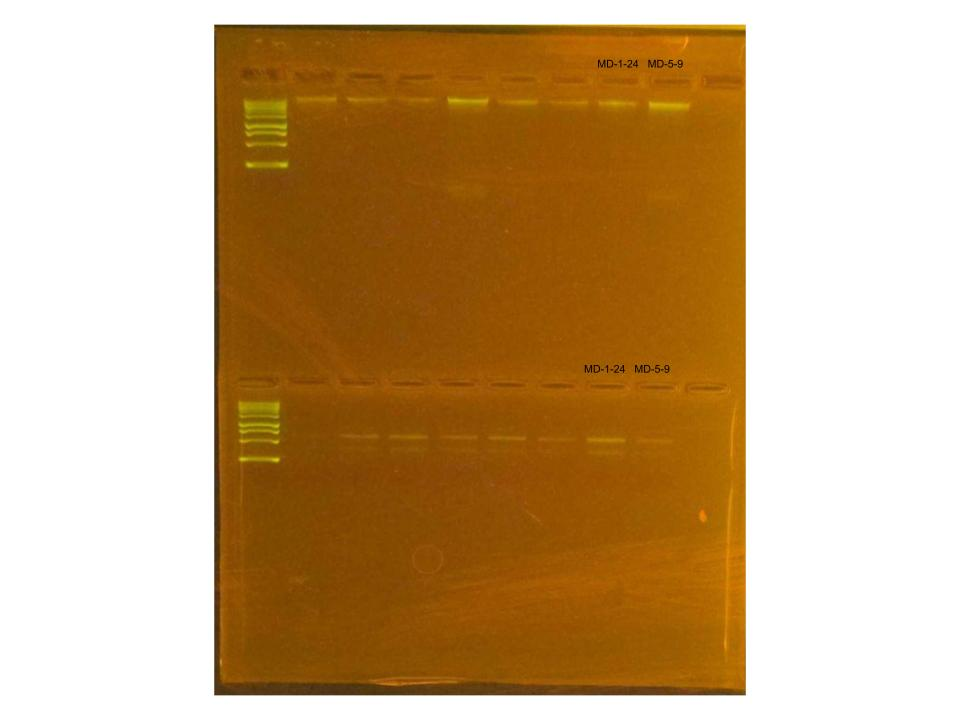

## RNA and DNA Extractions for ENCORE Project, May 29, 2025

### [Protocol Link](https://github.com/nchampney/NEC_Putnam_Lab_Notebook/blob/172f01784174bebceccae246c713908b109356b2/protocols/2025-05-28-Protocols_Zymo_Quick_DNA_RNA_Miniprep_Plus.md)

### Extraction of 2 samples from ENCORE project. The samples were collected in July and August 2024. 

### Samples

These samples were selected randomly from the a total of 100 samples. The sample IDs were MD-1-24 and MD-5-9.

## Notes

- Followed the linked protocol exactly 
- For sample prep bead beat was used in the original tube and vortexed for 1 minute. 

## Qubit Results

- Used Broad rand dsDNA and RNA Qubit Protocol [HERE](https://zdellaert.github.io/ZD_Putnam_Lab_Notebook/Qubit-Protocol/) 
- All samples read twice, standard only read once

RNA Standards: 388.38 (S1) and 8566.22 (S2)

| colony_id | Species                   | RNA_QBIT_1 | RNA_QBIT_2 | RNA_QBIT_AVG |
|-----------|---------------------------|------------|------------|--------------|
| MD-1-24   | *Madracis decactis*		|   20.2     | 19.8       |   20.0       |
| MD-5-9    | *Madracis decactis*       |   11.4     | 11.4       |   11.4       |

DNA Standards: 135.07 (S1) and 12167.49 (S2)

| colony_id | Species                   | DNA_QBIT_1 | DNA_QBIT_2 | DNA_QBIT_AVG |
|-----------|---------------------------|------------|------------|--------------|
| MD-1-24   | *Madracis decactis*		|   28.2     | 28.2       |   28.2       |
| MD-5-9    | *Madracis decactis*       |   16.3     | 16.2       |   16.25      |

## DNA and RNA Quality Check gel

Ran at 80 volts for 45 minutes-- the first 6 slots have Federica's samples

