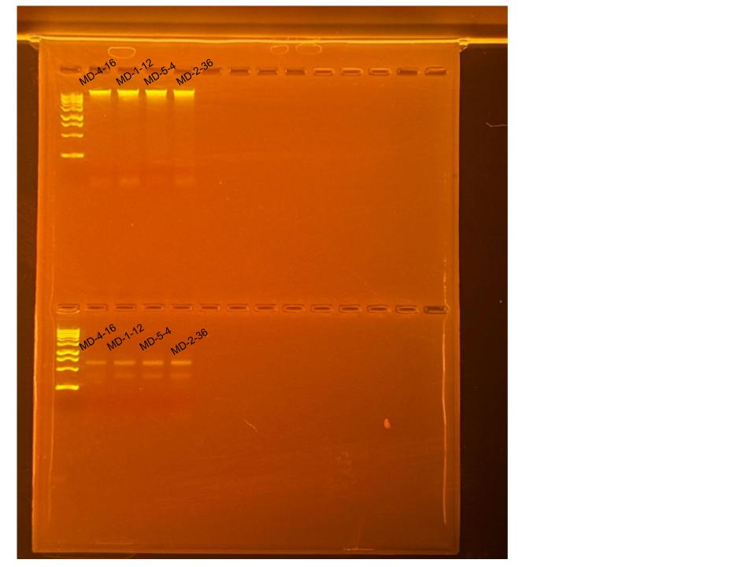

## RNA and DNA Extractions for ENCORE Project, June 3, 2025

### [Protocol Link](https://github.com/nchampney/NEC_Putnam_Lab_Notebook/blob/172f01784174bebceccae246c713908b109356b2/protocols/2025-05-28-Protocols_Zymo_Quick_DNA_RNA_Miniprep_Plus.md)

### Extraction of 4 samples from ENCORE project. The samples were collected in July and August 2024. 

### Samples

These samples were selected randomly from the a total of 100 samples. The sample IDs were MD-1-12, MD-4-16, MD-5-4, and MD-2-36. Sample MD-2-36 was not in the spreadsheet so I added a row at the bottom of the second page.

## Notes

- Followed the linked protocol exactly 
- For sample prep bead beat was used in the original tube and vortexed for 1 minute. 

## Qubit Results

- Used Broad range dsDNA and RNA Qubit Protocol [HERE](https://zdellaert.github.io/ZD_Putnam_Lab_Notebook/Qubit-Protocol/) 
- All samples read twice, standard only read once

RNA Standards: 384.67 (S1) and 8158.86 (S2)

| colony_id | Species                   | RNA_QBIT_1 | RNA_QBIT_2 | RNA_QBIT_AVG |
|-----------|---------------------------|------------|------------|--------------|
| MD-4-16   | *Madracis decactis*		|   12.4     | 14.2       |   13.3       |
| MD-1-12   | *Madracis decactis*       |   15.0     | 15.6       |   15.2       |
| MD-5-4    | *Madracis decactis*       |   16.4     | 16.6       |   16.5       |
| MD-2-36   | *Madracis decactis*       |   21.0     | 24.0       |   22.5       |

DNA Standards: 161.21 (S1) and 16414.33 (S2)

| colony_id | Species                   | DNA_QBIT_1 | DNA_QBIT_2 | DNA_QBIT_AVG |
|-----------|---------------------------|------------|------------|--------------|
| MD-4-16   | *Madracis decactis*		|   10.7     | 12.5       |   11.6       |
| MD-1-12   | *Madracis decactis*       |   17.9     | 21.2       |   19.55      |
| MD-5-4    | *Madracis decactis*       |   17.9     | 19.5       |   18.7       |
| MD-2-36   | *Madracis decactis*       |   16.8     | 19.4       |   18.1       |

## DNA and RNA Quality Check gel

Ran at 80 volts for 45 minutes

