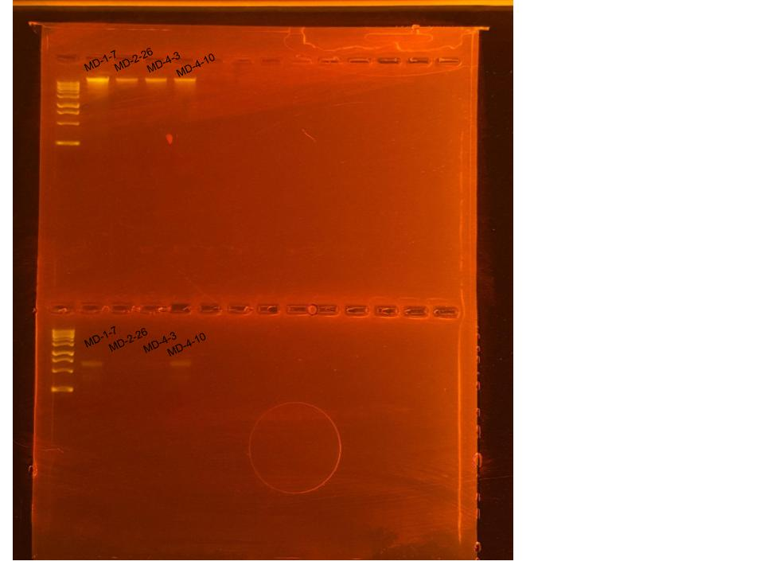

## RNA and DNA Extractions for ENCORE Project, June 4, 2025

### [Protocol Link](https://github.com/nchampney/NEC_Putnam_Lab_Notebook/blob/172f01784174bebceccae246c713908b109356b2/protocols/2025-05-28-Protocols_Zymo_Quick_DNA_RNA_Miniprep_Plus.md)

### Extraction of 4 samples from ENCORE project. The samples were collected in July and August 2024. 

### Samples

These samples were selected randomly from the a total of 100 samples. The sample IDs were MD-1-7, MD-2-26, MD-4-3, and MD-4-10. 

## Notes

- Followed the linked protocol exactly 
- For sample prep bead beat was used in the original tube and vortexed for 1 minute. 
- Samples MD-2-26 and MD-4-3 had very pale DNA shield after beating

## Qubit Results

- Used Broad rand dsDNA and RNA Qubit Protocol [HERE](https://zdellaert.github.io/ZD_Putnam_Lab_Notebook/Qubit-Protocol/) 
- All samples read twice, standard only read once

RNA Standards: 413.62 (S1) and 8791.95 (S2)

| colony_id | Species                   | RNA_QBIT_1 | RNA_QBIT_2 | RNA_QBIT_AVG |
|-----------|---------------------------|------------|------------|--------------|
| MD-1-7    | *Madracis decactis*		|   24.8     | 30.4       |   27.6       |
| MD-2-26   | *Madracis decactis*       |   14.8     | 11.2       |   13.0       |
| MD-4-3    | *Madracis decactis*       |   11.0     | 11.4       |   11.2       |
| MD-4-10   | *Madracis decactis*       |   17.8     | 23.4       |   20.6       |

DNA Standards: 161.13 (S1) and 18513.88 (S2)

| colony_id | Species                   | DNA_QBIT_1 | DNA_QBIT_2 | DNA_QBIT_AVG |
|-----------|---------------------------|------------|------------|--------------|
| MD-1-7    | *Madracis decactis*		|   33.8     | 36.6       |   35.2       |
| MD-2-26   | *Madracis decactis*       |   7.16     | 6.70       |   6.93       |
| MD-4-3    | *Madracis decactis*       |   8.68     | 8.66       |   8.67       |
| MD-4-10   | *Madracis decactis*       |   20.6     | 18.5       |   19.55      |

## DNA and RNA Quality Check gel

Ran at 80 volts for 45 minutes-- most of the MD-2-26 RNA sample dissipated into the buffer and did not make it into the well. About half of the MD-4-3 RNA sample also dissipated into the buffer.

