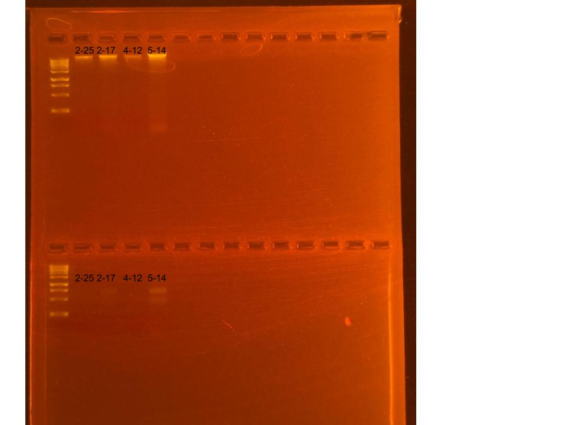

layout: post
title: 2025-06-06 ENCORE RNA and DNA Re-extractions
date: '2025-06-06'
categories: Processing
tags: [DNA, RNA, ENCORE]
---

## RNA and DNA Re-extractions for ENCORE Project, June 6, 2025

### [Protocol Link](https://github.com/nchampney/NEC_Putnam_Lab_Notebook/blob/172f01784174bebceccae246c713908b109356b2/protocols/2025-05-28-Protocols_Zymo_Quick_DNA_RNA_Miniprep_Plus.md)

### Re-extraction of 4 samples from ENCORE project that did not yield adequate results the first time. The samples were collected in July and August 2024. 

### Samples

These samples were selected chosen to be re-extracted after having low yields the first time. The ID numbers are MD-2-25, MD-2-17, MD-4-12, and MD-5-14

## Notes

- Followed the linked protocol exactly 
- For sample prep bead beat was used in the original tube and vortexed for and additional 1 minute. 
- Eluted to 80 uL for RNA and 100 uL for DNA

## Qubit Results

- Used Broad rand dsDNA and RNA Qubit Protocol [HERE](https://zdellaert.github.io/ZD_Putnam_Lab_Notebook/Qubit-Protocol/) 
- All samples read twice, standard only read once

RNA Standards: 429.35 (S1) and 8860.76 (S2)

| colony_id | Species                   | RNA_QBIT_1 | RNA_QBIT_2 | RNA_QBIT_AVG |
|-----------|---------------------------|------------|------------|--------------|
| MD-2-25   | *Madracis decactis*		|     -      | 11.4       |   11.4       |
| MD-2-17   | *Madracis decactis*       |   18.4     | 18.0       |   18.2       |
| MD-4-12   | *Madracis decactis*       |     -      |    -       |     -        |
| MD-5-14   | *Madracis decactis*       |   44.8     | 40.8       |   42.8       |

- DNA Qubit samples put in -20 freezer

## DNA and RNA Quality Check gel

Ran at 80 volts for 45 minutes

