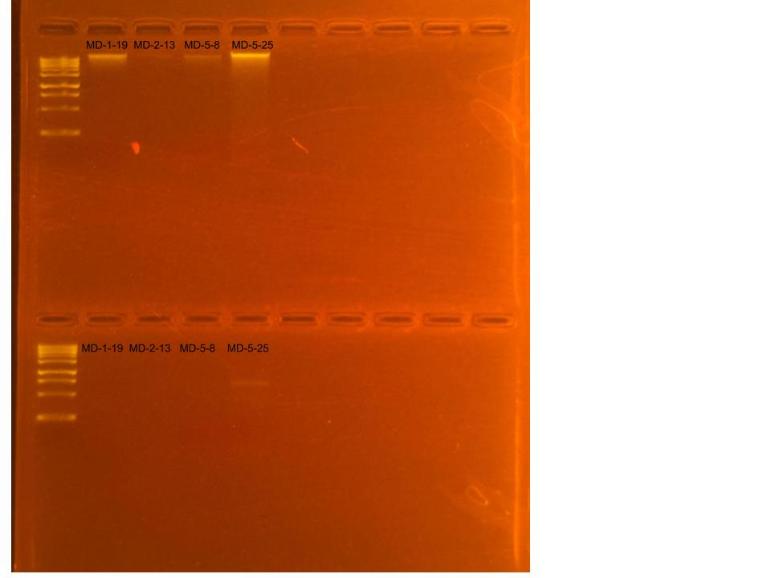

## RNA and DNA Re-extractions for ENCORE Project, June 9, 2025

### [Protocol Link](https://github.com/nchampney/NEC_Putnam_Lab_Notebook/blob/172f01784174bebceccae246c713908b109356b2/protocols/2025-05-28-Protocols_Zymo_Quick_DNA_RNA_Miniprep_Plus.md)

### Re-extraction of 4 samples from ENCORE project that did not yield adequate results the first time. The samples were collected in July and August 2024. 

### Samples

These samples were selected chosen to be re-extracted after having low yields the first time. The ID numbers are MD-1-19, MD-2-13, MD-5-8, and MD-5-25.

## Notes

- Followed the linked protocol exactly 
- For sample prep bead beat was used in the original tube and vortexed for and additional 1 minute. 
- RNA was eluted to 80 uL and DNA was eluted to 100 uL
    

## Qubit Results

- Used Broad rand dsDNA and RNA Qubit Protocol [HERE](https://zdellaert.github.io/ZD_Putnam_Lab_Notebook/Qubit-Protocol/) 
- All samples read twice, standard only read once 

Broad Range RNA Standards: 464.68 (S1) and 8061.41 (S2)

| colony_id | Species                   | RNA_QBIT_1 | RNA_QBIT_2 | RNA_QBIT_AVG |
|-----------|---------------------------|------------|------------|--------------|
| MD-1-19   | *Madracis decactis*		|     -      |    -       | Out of Range |
| MD-2-13   | *Madracis decactis*       |     -      |    -       | Out of Range |
| MD-5-8    | *Madracis decactis*       |     -      |    -       | Out of Range |
| MD-5-25   | *Madracis decactis*       |     -      | 10.6       |   10.6       |

Qubit redone using high sensitivity prep for samples MD-1-19, MD-2-13, MD-5-8, and MD-4-12 (from 6-6-25)

High Sensitivity RNA Standards: 73.91 (S1) and 1048.57 (S2)

| colony_id | Species                   | RNA_QBIT_1 | RNA_QBIT_2 | RNA_QBIT_AVG |
|-----------|---------------------------|------------|------------|--------------|
| MD-4-12   | *Madracis decactis*		|   4.00     |    -       |   4.00       |

High Sensitivity RNA Standards: 62.61 (S1) and 1095.77 (S2)

| colony_id | Species                   | RNA_QBIT_1 | RNA_QBIT_2 | RNA_QBIT_AVG |
|-----------|---------------------------|------------|------------|--------------|
| MD-1-19   | *Madracis decactis*		|    6.20    | 6.27       | 6.27         |
| MD-2-13   | *Madracis decactis*       |    6.42    | 6.55       | 6.55         |
| MD-5-8    | *Madracis decactis*       |     -      |    -       | Out of Range |

- DNA Qubit samples put in -20 freezer

## DNA and RNA Quality Check gel

Ran at 80 volts for 45 minutes

Most of the DNA sample for MD-2-13, and the RNA samples for MD-1-19 and MD-2-13 dissipated into the buffer of the gel.