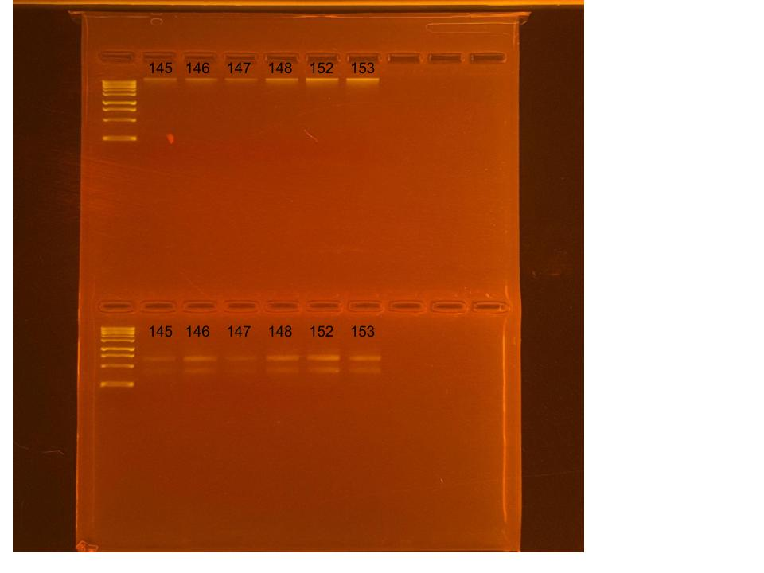

## RNA and DNA extractions for PocRAPID Project, June 16, 2025

### [Protocol Link](https://github.com/nchampney/NEC_Putnam_Lab_Notebook/blob/172f01784174bebceccae246c713908b109356b2/protocols/2025-05-28-Protocols_Zymo_Quick_DNA_RNA_Miniprep_Plus.md)

### Extraction of 6 pocillopora larva samples from PocRAPID project. The samples were collected in Bermuda throughout 2024. 

### Samples

The sample ID numbers are 145, 146, 147, 148, 152, and 153.

## Notes

- Not much DNA/RNA shield in the samples so I did not get 400 uL eluted from the original sample-- maybe use less beads next time to help
- Marked extracted samples with a dot on the top of the sample tubes
- Did 2 700uL washes for the RNA
- For sample prep bead beat was used in the original tube and vortexed for 1 minute. 
- Eluted to 80 uL 

## Qubit Results

- Used Broad range dsDNA and RNA Qubit Protocol [HERE](https://zdellaert.github.io/ZD_Putnam_Lab_Notebook/Qubit-Protocol/) 
- All samples read twice, standard only read once

DNA Standards: 180.13 (S1) and 28959.06 (S2)

| colony_id | Species                    | DNA_QBIT_1 | DNA_QBIT_2 | DNA_QBIT_AVG |
|-----------|----------------------------|------------|------------|--------------|
| 145       | *Pocillopora tuahiniensis* |     -      | 3.48       |   3.48       |
| 146       | *Pocillopora tuahiniensis* |   3.62     | 5.60       |   4.61       |
| 147       | *Pocillopora tuahiniensis* |     -      | 2.94       |   2.94       |
| 148       | *Pocillopora tuahiniensis* |   2.98     | 5.76       |   4.37       |
| 152       | *Pocillopora tuahiniensis* |   6.04     | 9.52       |   7.78       |
| 153       | *Pocillopora tuahiniensis* |   5.38     | 8.68       |   7.03       |

RNA Standards: 431.22 (S1) and 8176.96 (S2)

| colony_id | Species                    | RNA_QBIT_1 | RNA_QBIT_2 | RNA_QBIT_AVG |
|-----------|----------------------------|------------|------------|--------------|
| 145       | *Pocillopora tuahiniensis* |   27.8     | 27.8       |   27.8       |
| 146       | *Pocillopora tuahiniensis* |   42.8     | 37.8       |   40.3       |
| 147       | *Pocillopora tuahiniensis* |   14.8     | 15.8       |   15.3       |
| 148       | *Pocillopora tuahiniensis* |   32.0     | 36.0       |   34.0       |
| 152       | *Pocillopora tuahiniensis* |   64.2     | 65.4       |   64.8       |
| 153       | *Pocillopora tuahiniensis* |   70.0     | 76.8       |   73.4       |

- DNA samples in box 1 in -20 freezer, RNA samples in box 1 in -80 freezer

## DNA and RNA Quality Check gel

Ran at 80 volts for 45 minutes

