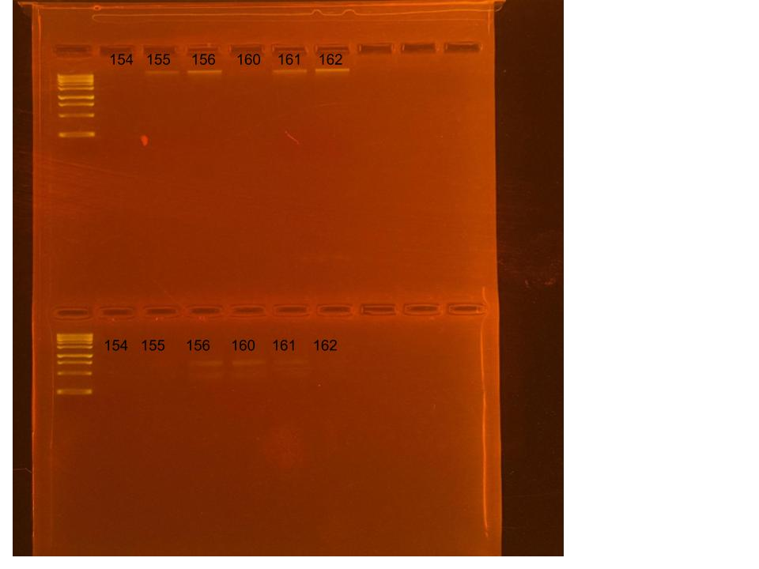

## RNA and DNA extractions for PocRAPID Project, June 17, 2025

### [Protocol Link](https://github.com/nchampney/NEC_Putnam_Lab_Notebook/blob/172f01784174bebceccae246c713908b109356b2/protocols/2025-05-28-Protocols_Zymo_Quick_DNA_RNA_Miniprep_Plus.md)

### Extraction of 6 pocillopora larva samples from PocRAPID project. The samples were collected in Bermuda throughout 2024. 

### Samples

The sample ID numbers are 154, 155, 156, 160, 161, and 162.

## Notes

- Not much DNA/RNA shield in the samples so I added 200 uL of DNA/RNA shield to the samples before bead beating
- I accidentally dumped the initial wash of sample 154 instead of saving it for RNA extraction
    - to Re-extract sample 154 I added another 600 uL of DNA/RNA shield and bead beat for 30 seconds then continued with the extraction protocol
- Marked extracted samples with a dot on the top of the sample tubes
- Did 2 700uL washes for the RNA
- For sample prep bead beat was used in the original tube and vortexed for 1 minute. 
- Eluted to 80 uL 

## Qubit Results

- Used Broad range dsDNA and RNA Qubit Protocol [HERE](https://zdellaert.github.io/ZD_Putnam_Lab_Notebook/Qubit-Protocol/) 
- All samples read twice, standard only read once

DNA Standards: 216.28 (S1) and 27701.54 (S2)

| colony_id | Species                   | DNA_QBIT_1 | DNA_QBIT_2 | DNA_QBIT_AVG |
|-----------|---------------------------|------------|------------|--------------|
| 154       | *Pocillopora*	         	|     -      |   -        |     -        |
| 155       | *Pocillopora*	            |     -      | 3.10       |   3.10       |
| 156       | *Pocillopora*	            |   3.02     | 5.06       |   4.04       |
| 160       | *Pocillopora*	            |   3.20     | 6.24       |   4.72       |
| 161       | *Pocillopora*	            |     -      | 2.48       |   2.48       |
| 162       | *Pocillopora*	            |   2.04     | 4.36       |   3.20       |

RNA Standards: 409.15 (S1) and 8128.22 (S2)

| colony_id | Species                   | RNA_QBIT_1 | RNA_QBIT_2 | RNA_QBIT_AVG |
|-----------|---------------------------|------------|------------|--------------|
| 154       | *Pocillopora*	         	|     -      | 11.6       |   11.6       |
| 155       | *Pocillopora*	            |   20.0     | 24.0       |   22.0       |
| 156       | *Pocillopora*	            |   34.2     | 37.6       |   35.9       |
| 160       | *Pocillopora*	            |   26.4     | 32.4       |   29.4       |
| 161       | *Pocillopora*	            |   19.2     | 22.8       |   21.0       |
| 162       | *Pocillopora*	            |   21.8     | 28.2       |   25.0       |

- DNA samples in box 1 in -20 freezer, RNA samples in box 1 in -80 freezer

## DNA and RNA Quality Check gel

Ran at 80 volts for 45 minutes

Gel Notes: Barely any of the 160 DNA sample made it into the well and most of many of the RNA samples also dissipated into the buffer.