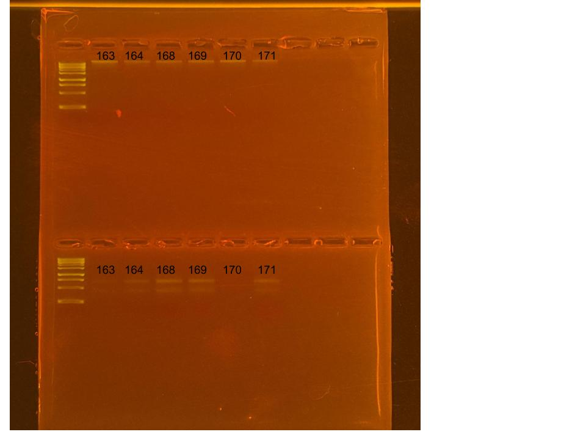

## RNA and DNA extractions for PocRAPID Project, June 18, 2025

### [Protocol Link](https://github.com/nchampney/NEC_Putnam_Lab_Notebook/blob/172f01784174bebceccae246c713908b109356b2/protocols/2025-05-28-Protocols_Zymo_Quick_DNA_RNA_Miniprep_Plus.md)

### Extraction of 6 pocillopora larva samples from PocRAPID project. The samples were collected in Bermuda throughout 2024. 

### Samples

The sample ID numbers are 163, 164, 168, 169, 170, and 171.

## Notes

- Not much DNA/RNA shield in the samples so I added 300 uL of DNA/RNA shield to the samples before bead beating
- Marked extracted samples with a dot on the top of the sample tubes
- Did 2 700uL washes for the RNA
- For sample prep bead beat was used in the original tube and vortexed for 1 minute. 
- Eluted to 80 uL 

## Qubit Results

- Used Broad range dsDNA and RNA Qubit Protocol [HERE](https://zdellaert.github.io/ZD_Putnam_Lab_Notebook/Qubit-Protocol/) 
- All samples read twice, standard only read once

DNA Standards: 144.56 (S1) and 19346.80 (S2)

| colony_id | Species                   | DNA_QBIT_1 | DNA_QBIT_2 | DNA_QBIT_AVG |
|-----------|---------------------------|------------|------------|--------------|
| 163       | *Pocillopora*	         	|   3.22     | 4.30       |   3.76       |
| 164       | *Pocillopora*	            |     -      | 3.36       |   3.36       |
| 168       | *Pocillopora*	            |     -      | 3.32       |   3.32       |
| 169       | *Pocillopora*	            |     -      | 3.92       |   3.92       |
| 170       | *Pocillopora*	            |   2.72     | 4.74       |   3.73       |
| 171       | *Pocillopora*	            |     -      | 3.20       |   3.20       |

RNA Standards: 412.83 (S1) and 7941.44 (S2)

| colony_id | Species                   | RNA_QBIT_1 | RNA_QBIT_2 | RNA_QBIT_AVG |
|-----------|---------------------------|------------|------------|--------------|
| 163       | *Pocillopora*	         	|   34.0     | 36.8       |   35.4       |
| 164       | *Pocillopora*	            |   16.8     | 20.8       |   18.8       |
| 168       | *Pocillopora*	            |   25.2     | 31.0       |   28.1       |
| 169       | *Pocillopora*	            |   22.2     | 27.8       |   25.0       |
| 170       | *Pocillopora*	            |   16.8     | 24.4       |   20.6       |
| 171       | *Pocillopora*	            |   15.0     | 25.2       |   20.1       |

- DNA samples in box 1 in -20 freezer, RNA samples in box 1 in -80 freezer

## DNA and RNA Quality Check gel

Ran at 80 volts for 45 minutes

Gel Notes: Most of RNA samples 163 and 170 dissipated into the buffer.