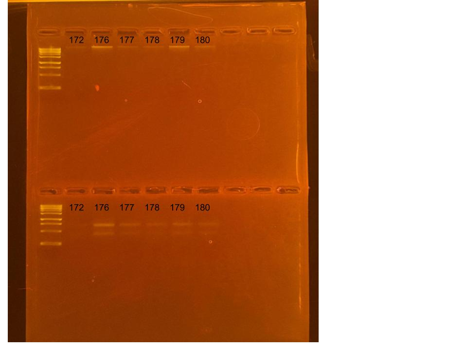

## RNA and DNA extractions for PocRAPID Project, June 19, 2025

### [Protocol Link](https://github.com/nchampney/NEC_Putnam_Lab_Notebook/blob/172f01784174bebceccae246c713908b109356b2/protocols/2025-05-28-Protocols_Zymo_Quick_DNA_RNA_Miniprep_Plus.md)

### Extraction of 6 pocillopora larva samples from PocRAPID project. The samples were collected in Bermuda throughout 2024. 

### Samples

The sample ID numbers are 172, 176, 177, 178, 179, and 180.

## Notes

- Not much DNA/RNA shield in the samples so I added 300 uL of DNA/RNA shield to the samples before bead beating
    - added too many glass beads to sample 172 so I added an additional 200 uL of shield so I could get enough for extraction
- Marked extracted samples with a dot on the top of the sample tubes
- Did 2 700uL washes for the RNA
- For sample prep bead beat was used in the original tube and vortexed for 1 minute. 
- Eluted to 80 uL 

## Qubit Results

- Used Broad range dsDNA and RNA Qubit Protocol [HERE](https://zdellaert.github.io/ZD_Putnam_Lab_Notebook/Qubit-Protocol/) 
- All samples read twice, standard only read once

DNA Standards: 175.31 (S1) and 22041.93 (S2)

| colony_id | Species                    | DNA_QBIT_1 | DNA_QBIT_2 | DNA_QBIT_AVG |
|-----------|----------------------------|------------|------------|--------------|
| 172       | *Pocillopora tuahiniensis* |     -      |   -        |     -        |
| 176       | *Pocillopora tuahiniensis* |   3.22     | 5.40       |   4.31       |
| 177       | *Pocillopora tuahiniensis* |     -      | 2.08       |   2.08       |
| 178       | *Pocillopora tuahiniensis* |     -      | 3.40       |   3.40       |
| 179       | *Pocillopora tuahiniensis* |     -      | 2.16       |   2.16       |
| 180       | *Pocillopora tuahiniensis* |     -      |   -        |     -        |

RNA Standards: 399.54 (S1) and 7566.24 (S2)

| colony_id | Species                    | RNA_QBIT_1 | RNA_QBIT_2 | RNA_QBIT_AVG |
|-----------|----------------------------|------------|------------|--------------|
| 172       | *Pocillopora tuahiniensis* |   10.6     | 29.4       |   20.0       |
| 176       | *Pocillopora tuahiniensis* |   32.6     | 24.6       |   28.6       |
| 177       | *Pocillopora tuahiniensis* |   16.2     | 15.6       |   15.9       |
| 178       | *Pocillopora tuahiniensis* |   10.8     | 13.6       |   12.2       |
| 179       | *Pocillopora tuahiniensis* |   19.4     | 19.8       |   19.6       |
| 180       | *Pocillopora tuahiniensis* |   14.2     | 16.2       |   15.2       |

- DNA samples in box 1 in -20 freezer, RNA samples in box 1 in -80 freezer

## DNA and RNA Quality Check gel

Ran at 80 volts for 45 minutes

