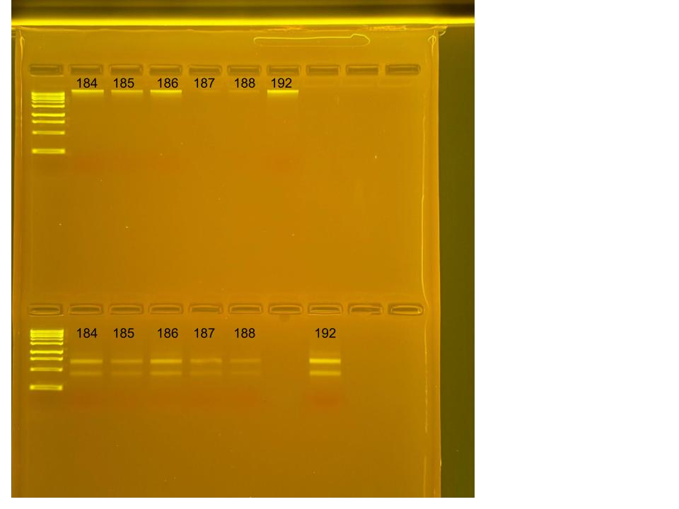

## RNA and DNA extractions for PocRAPID Project, June 23, 2025

### [Protocol Link](https://github.com/nchampney/NEC_Putnam_Lab_Notebook/blob/172f01784174bebceccae246c713908b109356b2/protocols/2025-05-28-Protocols_Zymo_Quick_DNA_RNA_Miniprep_Plus.md)

### Extraction of 6 pocillopora larva samples from PocRAPID project. The samples were collected in Bermuda throughout 2024. 

### Samples

The sample ID numbers are 184, 185, 186, 187, 188, and 192.

## Notes

- Not much DNA/RNA shield in the samples so I added 300 uL of DNA/RNA shield to the samples before bead beating
- Marked extracted samples with a dot on the top of the sample tubes
- Did 2 700uL washes for the RNA
- For sample prep bead beat was used in the original tube and vortexed for 1 minute. 
- Eluted to 80 uL 

## Qubit Results

- Used Broad range dsDNA and RNA Qubit Protocol [HERE](https://zdellaert.github.io/ZD_Putnam_Lab_Notebook/Qubit-Protocol/) 
- All samples read twice, standard only read once

DNA Standards: 147.66 (S1) and 21261.20 (S2)

| colony_id | Species                    | DNA_QBIT_1 | DNA_QBIT_2 | DNA_QBIT_AVG |
|-----------|----------------------------|------------|------------|--------------|
| 184       | *Pocillopora tuahiniensis* |   3.26     | 5.60       |   4.43       |
| 185       | *Pocillopora tuahiniensis* |   2.06     | 3.20       |   2.63       |
| 186       | *Pocillopora tuahiniensis* |   3.58     | 5.48       |   4.53       |
| 187       | *Pocillopora tuahiniensis* |     -      | 2.76       |   2.76       |
| 188       | *Pocillopora tuahiniensis* |     -      | 2.24       |   2.24       |
| 192       | *Pocillopora tuahiniensis* |   3.30     | 5.62       |   4.46       |

RNA Standards: 431.30 (S1) and 7815.90 (S2)

| colony_id | Species                    | RNA_QBIT_1 | RNA_QBIT_2 | RNA_QBIT_AVG |
|-----------|----------------------------|------------|------------|--------------|
| 184       | *Pocillopora tuahiniensis* |   14.6     | 18.6       |   16.6       |
| 185       | *Pocillopora tuahiniensis* |     -      | 10.4       |   10.4       |
| 186       | *Pocillopora tuahiniensis* |   18.0     | 21.2       |   19.6       |
| 187       | *Pocillopora tuahiniensis* |     -      | 14.8       |   14.8       |
| 188       | *Pocillopora tuahiniensis* |     -      |   -        |     -        |
| 192       | *Pocillopora tuahiniensis* |   21.4     | 25.8       |   23.6       |

- DNA samples in box 1 in -20 freezer, RNA samples in box 1 in -80 freezer

## DNA and RNA Quality Check gel

Ran at 80 volts for 45 minutes

Gel notes: DNA sample 187 dissipated into the buffer when loading and 192 is moved over a well because there was a bubble in the agarose.