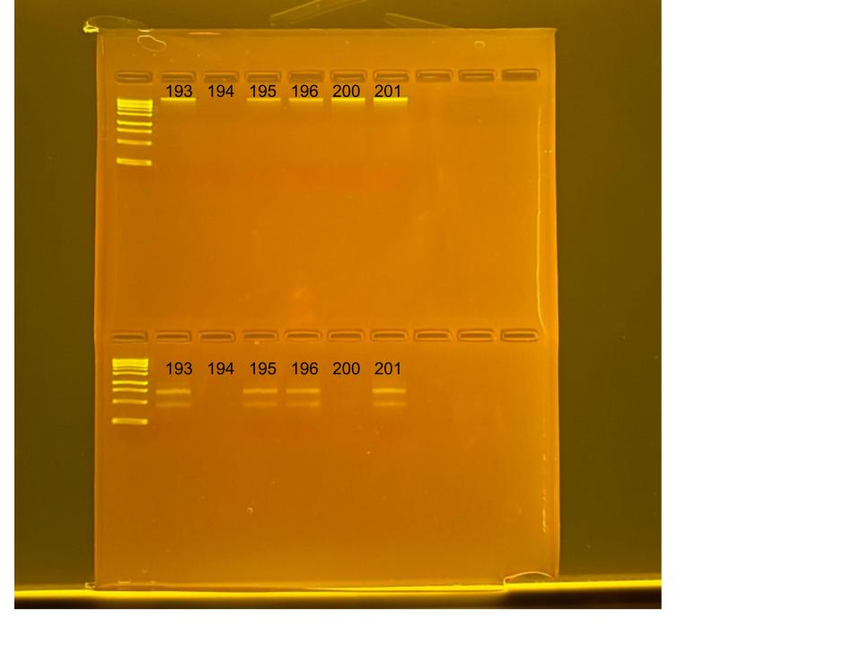

## RNA and DNA extractions for PocRAPID Project, June 30, 2025

### [Protocol Link](https://github.com/nchampney/NEC_Putnam_Lab_Notebook/blob/172f01784174bebceccae246c713908b109356b2/protocols/2025-05-28-Protocols_Zymo_Quick_DNA_RNA_Miniprep_Plus.md)

### Extraction of 6 pocillopora larva samples from PocRAPID project. The samples were collected in Moorea throughout 2024. 

### Samples

The sample ID numbers are 193, 194, 195, 196, 200, and 201.

## Notes

- Not much DNA/RNA shield in the samples so I added 300 uL of DNA/RNA shield to the samples before bead beating
- Marked extracted samples with a dot on the top of the sample tubes
- Did 2 700uL washes for the RNA
- For sample prep bead beat was used in the original tube and vortexed for 1 minute. 
- Eluted to 80 uL 

## Qubit Results

- Used Broad range dsDNA and RNA Qubit Protocol [HERE](https://zdellaert.github.io/ZD_Putnam_Lab_Notebook/Qubit-Protocol/) 
- All samples read twice, standard only read once

DNA Standards: 256.14 (S1) and 33021.94 (S2)

| colony_id | Species                    | DNA_QBIT_1 | DNA_QBIT_2 | DNA_QBIT_AVG |
|-----------|----------------------------|------------|------------|--------------|
| 193       | *Pocillopora tuahiniensis* |     -      | 2.62       |   2.62       |
| 194       | *Pocillopora tuahiniensis* |     -      |   -        |     -        |
| 195       | *Pocillopora tuahiniensis* |     -      |   -        |     -        |
| 196       | *Pocillopora tuahiniensis* |     -      |   -        |     -        |
| 200       | *Pocillopora tuahiniensis* |     -      | 4.00       |   4.00       |
| 201       | *Pocillopora tuahiniensis* |   2.34     | 4.40       |   3.37       |

RNA Standards: 440.39 (S1) and 8744.44 (S2)

| colony_id | Species                    | RNA_QBIT_1 | RNA_QBIT_2 | RNA_QBIT_AVG |
|-----------|----------------------------|------------|------------|--------------|
| 193       | *Pocillopora tuahiniensis* |   21.0     | 23.6       |   22.3       |
| 194       | *Pocillopora tuahiniensis* |     -      |   -        |     -        |
| 195       | *Pocillopora tuahiniensis* |   19.2     | 21.2       |   20.2       |
| 196       | *Pocillopora tuahiniensis* |   15.0     | 20.4       |   17.7       |
| 200       | *Pocillopora tuahiniensis* |   13.8     | 16.8       |   15.3       |
| 201       | *Pocillopora tuahiniensis* |   19.0     | 25.6       |   22.3       |

- DNA samples in box 1 in -20 freezer, RNA samples in box 1 in -80 freezer

## DNA and RNA Quality Check gel

Ran at 80 volts for 45 minutes

Gel notes: RNA samples 194 and 200 dissipated completely into the buffer when loading