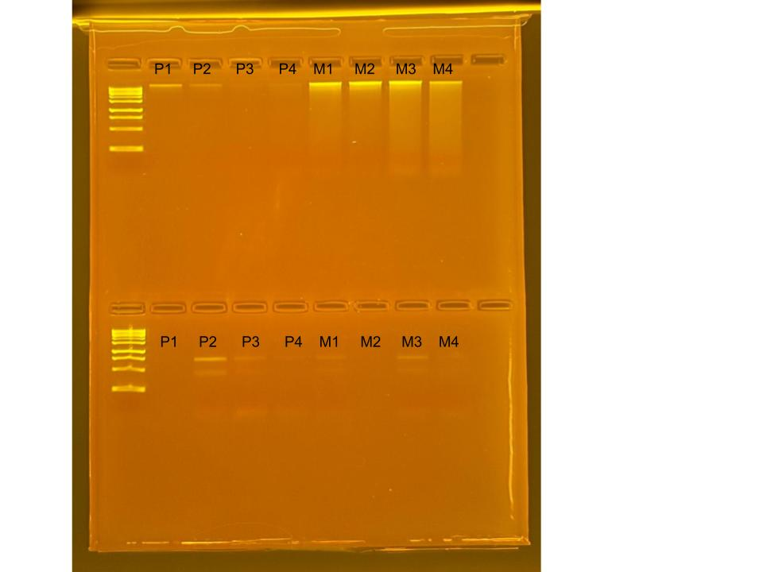

## RNA and DNA extractions for TimeSeries Project, July 03, 2025

### [Protocol Link](https://github.com/nchampney/NEC_Putnam_Lab_Notebook/blob/172f01784174bebceccae246c713908b109356b2/protocols/2025-05-28-Protocols_Zymo_Quick_DNA_RNA_Miniprep_Plus.md)

### Extraction of 4 random *Porites compressa* samples and 4 random *Montipora capitata* samples taken from the aquarium tank on July 2, 2025. These samples were prepared to test the extraction protocol before samples from the actual TimeSeries experiment are extracted. 

### Samples

The sample ID numbers are P1, P2, P3, P4, M1, M2, M3, and M4.

## Notes

- For sample prep bead beat was used in the original tube and vortexed for 1 minute. 
- Eluted to 80 uL 

## Qubit Results

- Used Broad range dsDNA and RNA Qubit Protocol [HERE](https://zdellaert.github.io/ZD_Putnam_Lab_Notebook/Qubit-Protocol/) 
- All samples read twice, standard only read once

DNA Standards: 208.02 (S1) and 27535.27 (S2)

| colony_id | Species                    | DNA_QBIT_1 | DNA_QBIT_2 | DNA_QBIT_AVG |
|-----------|----------------------------|------------|------------|--------------|
| P1        | *Porites compressa*        |   2.32     | 4.94       |   3.63       |
| P2        | *Porites compressa*        |     -      | 3.10       |   3.10       |
| P3        | *Porites compressa*        |     -      |   -        |     -        |
| P4        | *Porites compressa*        |     -      |   -        |     -        |
| M1        | *Montipora capitata*       |   10.6     | 17.8       |   14.2       |
| M2        | *Montipora capitata*       |   13.3     | 19.3       |   16.3       |
| M3        | *Montipora capitata*       |   26.2     | 28.6       |   27.4       |
| M4        | *Montipora capitata*       |   18.0     | 18.6       |   18.3       |

RNA Standards: 461.18 (S1) and 9208.49 (S2)

| colony_id | Species                    | RNA_QBIT_1 | RNA_QBIT_2 | RNA_QBIT_AVG |
|-----------|----------------------------|------------|------------|--------------|
| P1        | *Porites compressa*        |     -      |   -        |     -        |
| P2        | *Porites compressa*        |     -      | 15.2       |   15.2       |
| P3        | *Porites compressa*        |     -      |   -        |     -        |
| P4        | *Porites compressa*        |     -      |   -        |     -        |
| M1        | *Montipora capitata*       |     -      |   -        |     -        |
| M2        | *Montipora capitata*       |     -      |   -        |     -        |
| M3        | *Montipora capitata*       |     -      |   -        |     -        |
| M4        | *Montipora capitata*       |     -      |   -        |     -        |

- DNA samples in -20 freezer, RNA samples in -80 freezer

## DNA and RNA Quality Check gel

Ran at 80 volts for 45 minutes

Gel notes: RNA samples P1 and M2, and DNA P1 dissipated into the buffer when loading