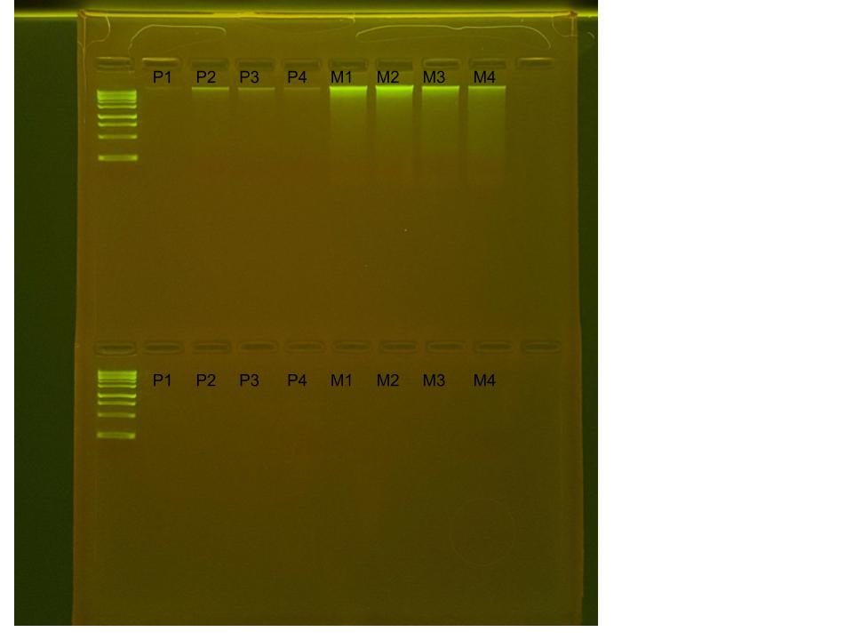

## RNA and DNA extractions for TimeSeries Project, July 07, 2025

### [Protocol Link](https://github.com/nchampney/NEC_Putnam_Lab_Notebook/blob/172f01784174bebceccae246c713908b109356b2/protocols/2025-05-28-Protocols_Zymo_Quick_DNA_RNA_Miniprep_Plus.md)

### Extraction of 4 random *Porites compressa* samples and 4 random *Montipora capitata* samples taken from the aquarium tank on July 2, 2025. These samples were prepared to test the extraction protocol before samples from the actual TimeSeries experiment are extracted. Re-extracting with small tweaks to protocol to try and improve DNA and RNA yield. 

### Samples

The sample ID numbers are P1, P2, P3, P4, M1, M2, M3, and M4.

## Notes

- For sample prep bead beat was used in the original tube and vortexed for an additonal 2 minutes. 
- The DNA/RNA shield of samples P3, P4, M3, and M4 were dilluted to half by adding 200 ul of shield from the sample and 200 ul of clean DNA/RNA shield 
- 500 ul of DNA/RNA shield was added to the sample tubes before putting them back into the freezer for storage. 
- Eluted to 80 uL 

## Qubit Results

- Used Broad range dsDNA and RNA Qubit Protocol [HERE](https://zdellaert.github.io/ZD_Putnam_Lab_Notebook/Qubit-Protocol/) 
- All samples read twice, standard only read once

DNA Standards: 204.84 (S1) and 27724.72 (S2)

| colony_id | Species                    | DNA_QBIT_1 | DNA_QBIT_2 | DNA_QBIT_AVG |
|-----------|----------------------------|------------|------------|--------------|
| P1        | *Porites compressa*        |   8.92     | 16.8       |   12.86      |
| P2        | *Porites compressa*        |   3.34     | 6.18       |   4.76       |
| P3        | *Porites compressa*        |     -      | 6.18       |   6.18       |
| P4        | *Porites compressa*        |     -      | 3.90       |   3.90       |
| M1        | *Montipora capitata*       |   25.8     | 38.4       |   32.1       |
| M2        | *Montipora capitata*       |   30.8     | 49.4       |   40.1       |
| M3        | *Montipora capitata*       |   20.6     | 13.4       |   17.0       |
| M4        | *Montipora capitata*       |   14.9     | 11.2       |   13.05      |

RNA Standards: 448.00 (S1) and 8200.78 (S2)

| colony_id | Species                    | RNA_QBIT_1 | RNA_QBIT_2 | RNA_QBIT_AVG |
|-----------|----------------------------|------------|------------|--------------|
| P1        | *Porites compressa*        |    10.6    | 10.8       |   10.7       |
| P2        | *Porites compressa*        |     -      |   -        |     -        |
| P3        | *Porites compressa*        |     -      |   -        |     -        |
| P4        | *Porites compressa*        |     -      |   -        |     -        |
| M1        | *Montipora capitata*       |     -      |   -        |     -        |
| M2        | *Montipora capitata*       |     -      | 12.2       |   12.2       |
| M3        | *Montipora capitata*       |     -      |   -        |     -        |
| M4        | *Montipora capitata*       |     -      |   -        |     -        |

- DNA samples in -20 freezer, RNA samples in -80 freezer

## DNA and RNA Quality Check gel

Ran at 80 volts for 45 minutes

Gel notes: RNA samples P1, P2, P3, M1, M2 and M3, and DNA P1 dissipated into the buffer when loading