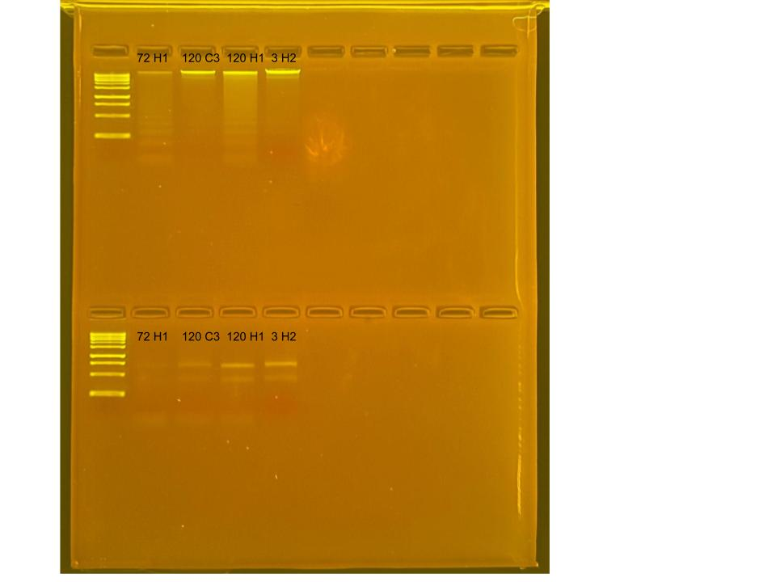

## RNA and DNA extractions for TimeSeries Project, July 08, 2025

### [Protocol Link](https://github.com/zdellaert/ZD_Putnam_Lab_Notebook/blob/master/protocols/2022-10-03-Protocols_Zymo_Quick_DNA_RNA_Miniprep_Plus.md)

### Extraction of 4 random *Porites compressa* samples from the TimeSeries experiment done in June 2025 

### Samples

The sample ID numbers are 72 H1, 120 C3, 120 H1, and 3 H2. 

## Notes

- For sample prep bead beat was used in the original tube and vortexed for 2 minutes.  
- Eluted to 80 uL 

## Qubit Results

- Used Broad range dsDNA and RNA Qubit Protocol [HERE](https://zdellaert.github.io/ZD_Putnam_Lab_Notebook/Qubit-Protocol/) 
- All samples read twice, standard only read once

DNA Standards: 155.39 (S1) and 17686.40 (S2)

| colony_id | Species                    | DNA_QBIT_1 | DNA_QBIT_2 | DNA_QBIT_AVG |
|-----------|----------------------------|------------|------------|--------------|
| 72 H1     | *Porites compressa*        |   6.76     | 6.66       |   6.71       |
| 120 C3    | *Porites compressa*        |   10.3     | 10.2       |   10.25      |
| 120 H1    | *Porites compressa*        |   16.7     | 16.4       |   16.55      |
| 3 H2      | *Porites compressa*        |   21.2     | 21.0       |   21.1       |

RNA Standards: 376.76 (S1) and 8000.96 (S2)

| colony_id | Species                    | RNA_QBIT_1 | RNA_QBIT_2 | RNA_QBIT_AVG |
|-----------|----------------------------|------------|------------|--------------|
| 72 H1     | *Porites compressa*        |    10.6    | 10.8       |   10.7       |
| 120 C3    | *Porites compressa*        |    16.0    | 15.6       |   15.8       |
| 120 H1    | *Porites compressa*        |    17.4    | 18.2       |   17.8       |
| 3 H2      | *Porites compressa*        |    21.0    | 21.0       |   21.0       |

- DNA samples in -20 freezer, RNA samples in -80 freezer

## DNA and RNA Quality Check gel

Ran at 80 volts for 45 minutes

