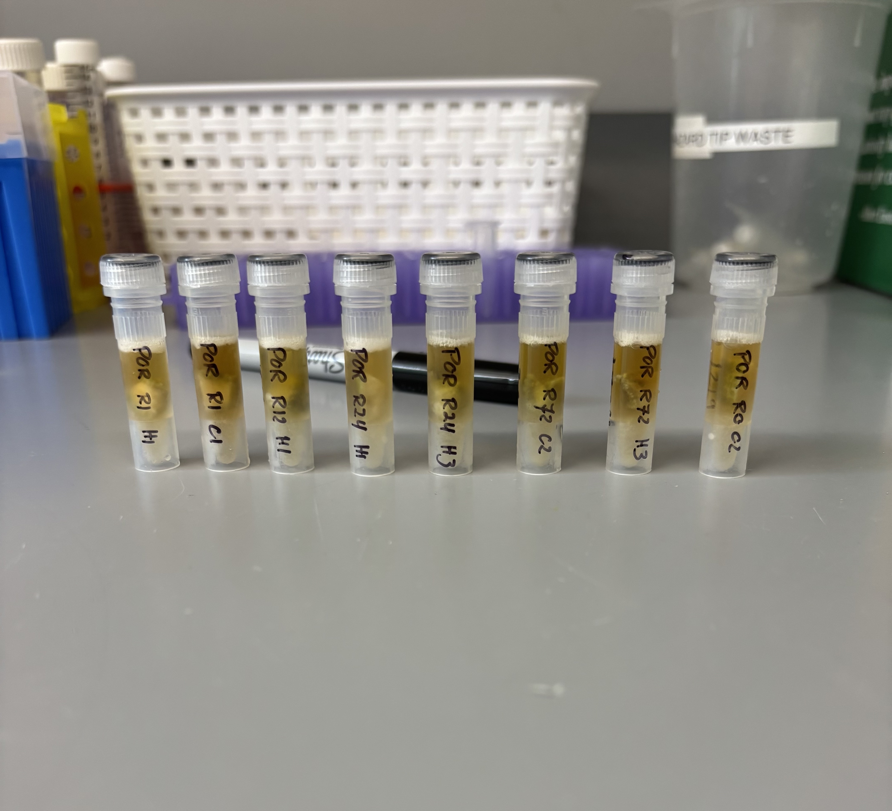
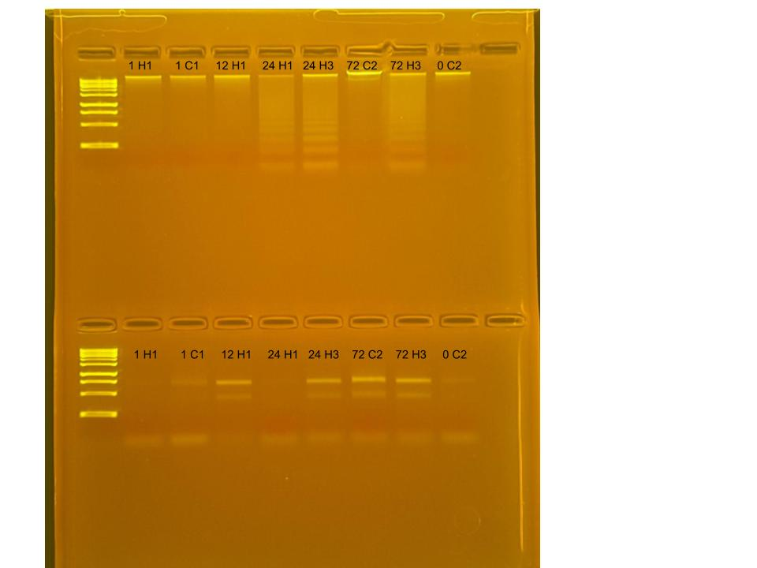

## RNA and DNA extractions for TimeSeries Project, July 09, 2025

### [Protocol Link](https://github.com/zdellaert/ZD_Putnam_Lab_Notebook/blob/master/protocols/2022-10-03-Protocols_Zymo_Quick_DNA_RNA_Miniprep_Plus.md)

### Extraction of 8 random *Porites compressa* samples from the TimeSeries experiment done in June 2025. 

### Samples

The sample ID numbers are 1 H1, 1 C1, 12 H1, 24 H1, 24 H3, 72 C2, 72 H3 and 0 C2. 

## Notes

- For sample prep bead beat was used in the original tube and vortexed for 2 minutes.  
- Eluted to 80 uL 

## Qubit Results

- Used Broad range dsDNA and RNA Qubit Protocol [HERE](https://zdellaert.github.io/ZD_Putnam_Lab_Notebook/Qubit-Protocol/) 
- All samples read twice, standard only read once

DNA Standards: 179.20 (S1) and 21593.84 (S2)

| colony_id | Species                    | DNA_QBIT_1 | DNA_QBIT_2 | DNA_QBIT_AVG |
|-----------|----------------------------|------------|------------|--------------|
| 1 H1      | *Porites compressa*        |   4.32     | 4.42       |   4.37       |
| 1 C1      | *Porites compressa*        |   3.02     | 3.14       |   3.08       |
| 12 H1     | *Porites compressa*        |   4.32     | 4.48       |   4.40       |
| 24 H1     | *Porites compressa*        |   6.60     | 6.78       |   6.69       |
| 24 H3     | *Porites compressa*        |   9.34     | 9.68       |   9.51       |
| 72 C2     | *Porites compressa*        |   9.98     | 10.3       |   10.14      |
| 72 H3     | *Porites compressa*        |   12.4     | 12.6       |   12.5       |
| 0 C2      | *Porites compressa*        |   4.40     | 4.36       |   4.38       |

RNA Standards: 377.26 (S1) and 8126.73 (S2)

| colony_id | Species                    | RNA_QBIT_1 | RNA_QBIT_2 | RNA_QBIT_AVG |
|-----------|----------------------------|------------|------------|--------------|
| 1 H1      | *Porites compressa*        |   10.4     | 10.4       |   10.4       |
| 1 C1      | *Porites compressa*        |   15.2     | 15.2       |   15.2       |
| 12 H1     | *Porites compressa*        |   15.4     | 16.0       |   15.7       |
| 24 H1     | *Porites compressa*        |     -      | 10.0       |   10.0       |
| 24 H3     | *Porites compressa*        |   16.6     | 17.0       |   16.8       |
| 72 C2     | *Porites compressa*        |   25.6     | 26.0       |   25.8       |
| 72 H3     | *Porites compressa*        |   23.4     | 23.0       |   23.2       |
| 0 C2      | *Porites compressa*        |   12.8     | 12.8       |   12.8       |

- DNA samples in -20 freezer, RNA samples in -80 freezer

## DNA and RNA Quality Check gel

Ran at 80 volts for 45 minutes

