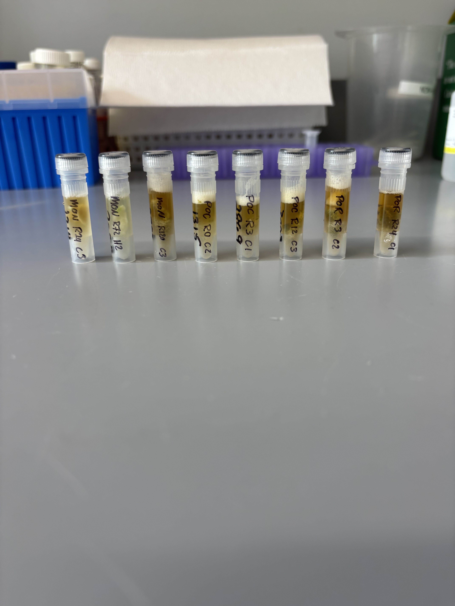
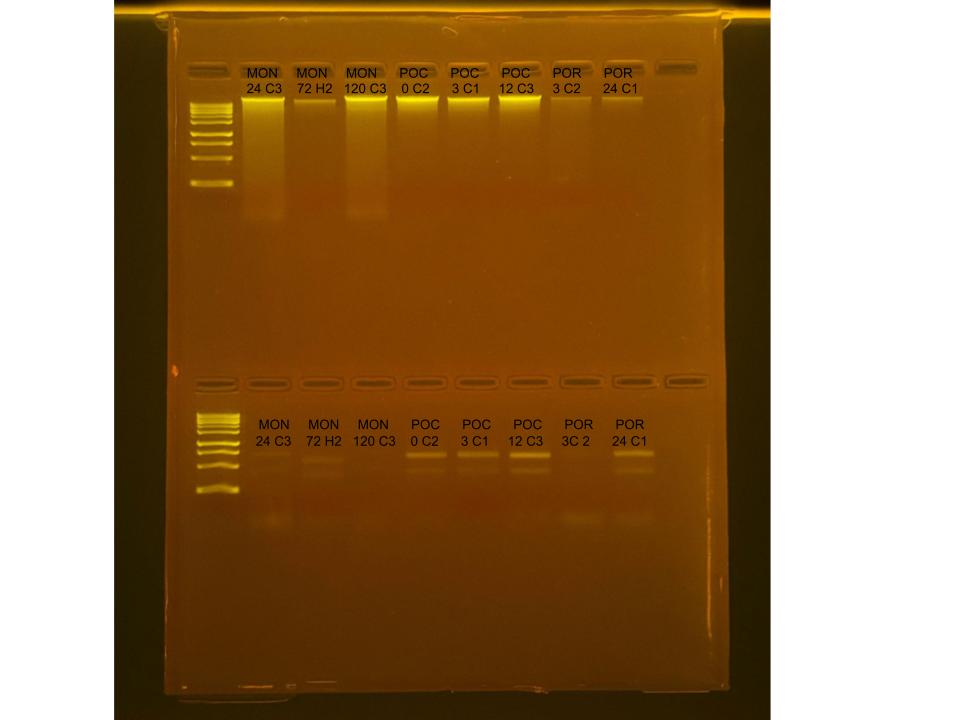

## RNA and DNA extractions for Time Series Project, July 14, 2025

### [Protocol Link](https://github.com/zdellaert/ZD_Putnam_Lab_Notebook/blob/master/protocols/2022-10-03-Protocols_Zymo_Quick_DNA_RNA_Miniprep_Plus.md)

### Extraction of 8 random samples from the Time Series experiment done in June and July of 2025. The samples include all 3 species involved in the experiment.

### Samples

The sample IDs are MON 24 C3, MON 72 H2, MON 120 C3, POC 0 C2, POC 3 C1, POC 12 C3, POR 3 C2, and POR 24 C1.  

Image taken after bead beating

Notes: Next time I will try dilluting the DNA/RNA shield of the Montipora samples to try to improve the RNA yield from that species. 

## Notes

- For sample prep bead beat was used in the original tube and vortexed for 2 minutes.  
- Eluted to 80 uL 

## Qubit Results

- Used Broad range dsDNA and RNA Qubit Protocol [HERE](https://zdellaert.github.io/ZD_Putnam_Lab_Notebook/Qubit-Protocol/) 
- All samples read twice, standard only read once

DNA Standards: 190.18 (S1) and 22298.06 (S2)

| colony_id | Species                    | DNA_QBIT_1 | DNA_QBIT_2 | DNA_QBIT_AVG |
|-----------|----------------------------|------------|------------|--------------|
| 24 C3     | *Montipora capitata*       |   41.6     | 43.4       |   42.5       |
| 72 H2     | *Montipora capitata*       |   4.42     | 4.58       |   4.50       |
| 120 C3    | *Montipora capitata*       |   39.8     | 41.2       |   40.5       |
| 0 C2      | *Pocillopora acuta*        |   32.0     | 32.8       |   32.4       |
| 3 C1      | *Pocillopora acuta*        |   17.3     | 17.9       |   17.6       |
| 12 C3     | *Pocillopora acuta*        |   33.6     | 34.4       |   34.0       |
| 3 C2      | *Porites compressa*        |   6.36     | 6.40       |   6.38       |
| 24 C1     | *Porites compressa*        |   3.42     | 3.44       |   3.43       |

RNA Standards: 378.60 (S1) and 8016.11 (S2)

| colony_id | Species                    | RNA_QBIT_1 | RNA_QBIT_2 | RNA_QBIT_AVG |
|-----------|----------------------------|------------|------------|--------------|
| 24 C3     | *Montipora capitata*       |     -      |   -        |     -        |
| 72 H2     | *Montipora capitata*       |   13.2     | 13.8       |   13.5       |
| 120 C3    | *Montipora capitata*       |     -      |   -        |     -        |
| 0 C2      | *Pocillopora acuta*        |   17.8     | 18.4       |   18.1       |
| 3 C1      | *Pocillopora acuta*        |   20.8     | 20.6       |   20.7       |
| 12 C3     | *Pocillopora acuta*        |   28.4     | 28.8       |   28.6       |
| 3 C2      | *Porites compressa*        |   19.2     | 18.8       |   19.0       |
| 24 C1     | *Porites compressa*        |   33.8     | 33.6       |   33.7       |

- DNA samples in -20 freezer, RNA samples in -80 freezer

## DNA and RNA Quality Check gel

Ran at 80 volts for 45 minutes

