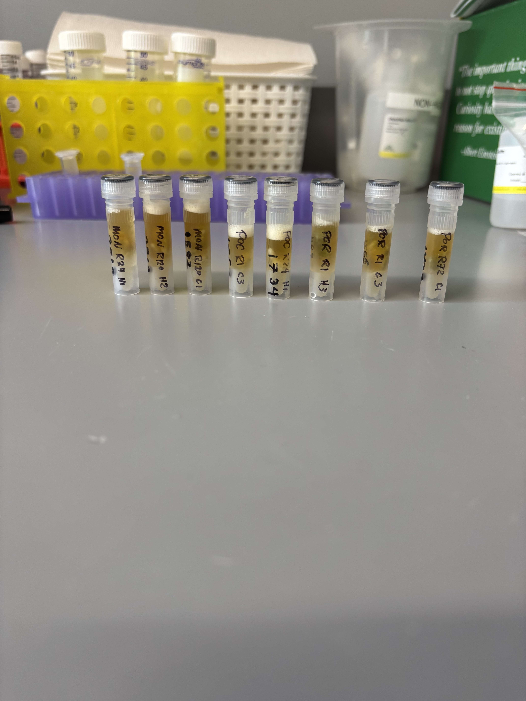
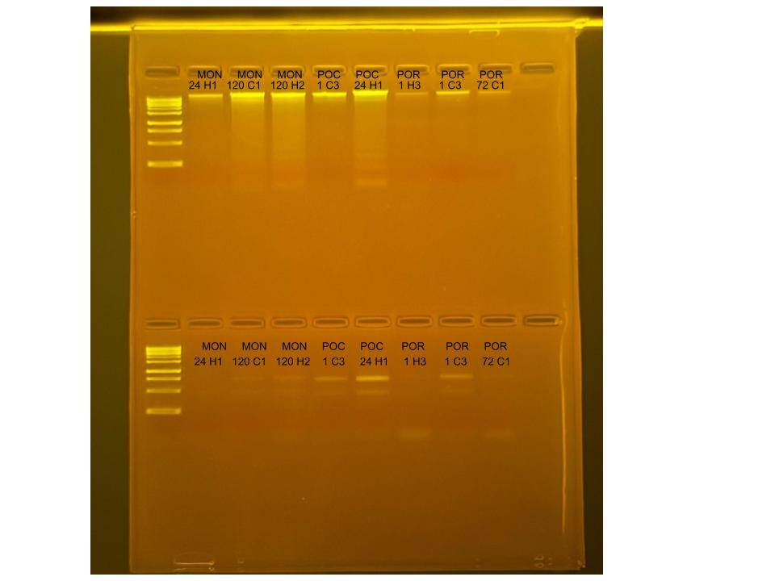

## RNA and DNA extractions for Time Series Project, July 15, 2025

### [Protocol Link](https://github.com/zdellaert/ZD_Putnam_Lab_Notebook/blob/master/protocols/2022-10-03-Protocols_Zymo_Quick_DNA_RNA_Miniprep_Plus.md)

### Extraction of 8 random samples from the Time Series experiment done in June and July of 2025. The samples include all 3 species involved in the experiment.

### Samples

The sample IDs are MON 24 H1, MON 120 C1, MON 120 H2, POC 1 C3, POC 24 H1, POR 1 H3, POR 1 C3, and POR 72 C1.  

 Image from after 2 minute bead beat

## Notes

- For sample prep bead beat was used in the original tube and vortexed for 2 minutes. 
- Montipora DNA/RNA shield was dilluted to half before extracting (200 uL taken from the sample tube and 200 ul clean shield) 
- Eluted to 80 uL 

## Qubit Results

- Used Broad range dsDNA and RNA Qubit Protocol [HERE](https://zdellaert.github.io/ZD_Putnam_Lab_Notebook/Qubit-Protocol/) 
- All samples read twice, standard only read once

DNA Standards: 171.07 (S1) and 20473.19 (S2)

| colony_id | Species                    | DNA_QBIT_1 | DNA_QBIT_2 | DNA_QBIT_AVG |
|-----------|----------------------------|------------|------------|--------------|
| 24 H1     | *Montipora capitata*       |   7.24     | 7.42       |   7.33       |
| 120 C1    | *Montipora capitata*       |   31.4     | 32.2       |   31.8       |
| 120 H2    | *Montipora capitata*       |   26.6     | 27.2       |   26.9       |
| 1 C3      | *Pocillopora acuta*        |   12.7     | 13.0       |   12.85      |
| 24 H1     | *Pocillopora acuta*        |   41.0     | 43.0       |   42.0       |
| 1 H3      | *Porites compressa*        |   2.84     | 2.94       |   2.89       |
| 1 C3      | *Porites compressa*        |   5.78     | 5.70       |   5.74       |
| 72 C1     | *Porites compressa*        |   2.82     | 2.80       |   2.81       |

RNA Standards: 375.55 (S1) and 7990.78 (S2)

| colony_id | Species                    | RNA_QBIT_1 | RNA_QBIT_2 | RNA_QBIT_AVG |
|-----------|----------------------------|------------|------------|--------------|
| 24 H1     | *Montipora capitata*       |     -      |   -        |     -        |
| 120 C1    | *Montipora capitata*       |     -      |   -        |     -        |
| 120 H2    | *Montipora capitata*       |     -      |   -        |     -        |
| 1 C3      | *Pocillopora acuta*        |   13.4     | 13.8       |   13.6       |
| 24 H1     | *Pocillopora acuta*        |   25.8     | 25.8       |   25.8       |
| 1 H3      | *Porites compressa*        |   11.6     | 12.0       |   11.8       |
| 1 C3      | *Porites compressa*        |   20.0     | 20.2       |   20.1       |
| 72 C1     | *Porites compressa*        |   11.6     | 12.2       |   11.9       |

- DNA samples in -20 freezer, RNA samples in -80 freezer

## DNA and RNA Quality Check gel

Ran at 80 volts for 45 minutes

