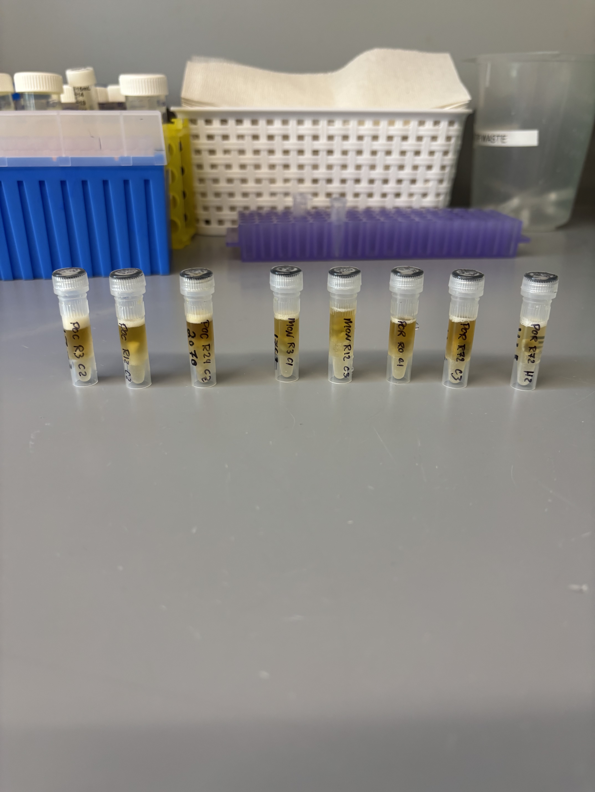
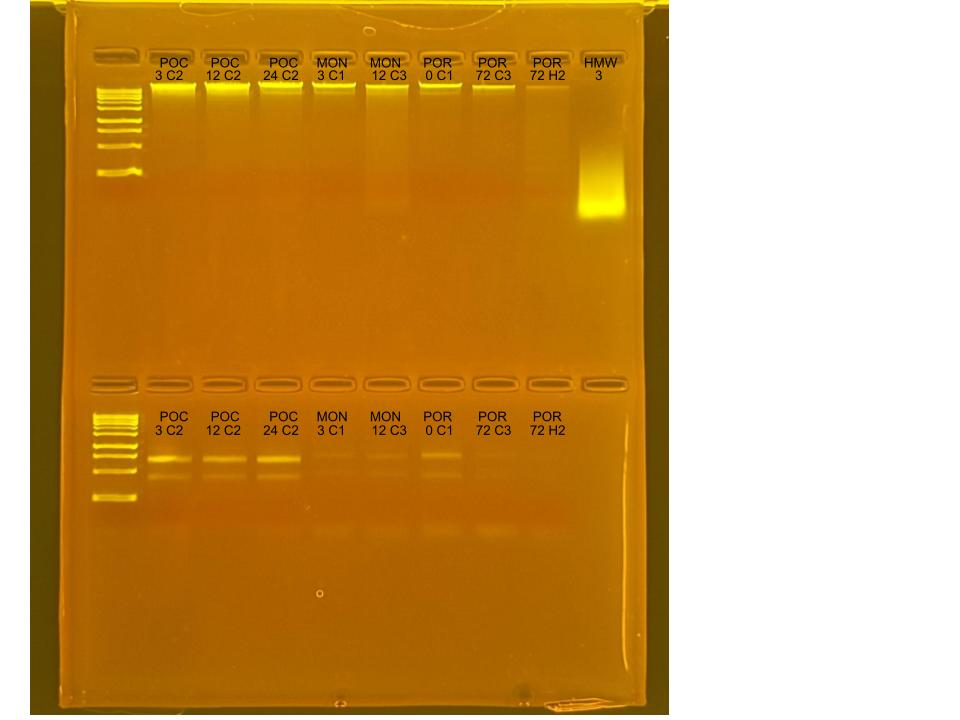

## RNA and DNA extractions for Time Series Project, July 16, 2025

### [Protocol Link](https://github.com/zdellaert/ZD_Putnam_Lab_Notebook/blob/master/protocols/2022-10-03-Protocols_Zymo_Quick_DNA_RNA_Miniprep_Plus.md)

### Extraction of 8 random samples from the Time Series experiment done in June and July of 2025. The samples include all 3 species involved in the experiment.

### Samples

The sample IDs are POC 3 C2, POC 12 C2, POC 24 C2, MON 3 C1, MON 12 C3, POR 0 C1, POR 72 C3, and POR 72 H2.  

 Image from after bead beating

## Notes

- For sample prep bead beat was used in the original tube and vortexed for 2 minutes. 
    - Montipora samples were bead beat for only 1 minute
- Increased Pro K digestion time to 30 mins for all samples 
- Eluted to 80 uL 

## Qubit Results

- Used Broad range dsDNA and RNA Qubit Protocol [HERE](https://zdellaert.github.io/ZD_Putnam_Lab_Notebook/Qubit-Protocol/) 
- All samples read twice, standard only read once

DNA Standards: 163.03 (S1) and 18996.60 (S2)

| colony_id | Species                    | DNA_QBIT_1 | DNA_QBIT_2 | DNA_QBIT_AVG |
|-----------|----------------------------|------------|------------|--------------|
| 3 C2      | *Pocillopora acuta*        |   38.0     | 38.4       |   38.2       |
| 12 C2     | *Pocillopora acuta*        |   44.2     | 45.0       |   44.6       |
| 24 C2     | *Pocillopora acuta*        |   44.2     | 45.2       |   44.7       |
| 3 C1      | *Montipora capitata*       |   10.0     | 10.3       |   10.15      |
| 12 C3     | *Montipora capitata*       |   15.8     | 16.3       |   16.05      |
| 0 C1      | *Porites compressa*        |   16.8     | 17.1       |   16.95      |
| 72 C3     | *Porites compressa*        |   7.76     | 7.68       |   7.72       |
| 72 H2     | *Porites compressa*        |   6.06     | 5.94       |   6.00       |

RNA Standards: 376.61 (S1) and 8030.02 (S2)

| colony_id | Species                    | RNA_QBIT_1 | RNA_QBIT_2 | RNA_QBIT_AVG |
|-----------|----------------------------|------------|------------|--------------|
| 3 C2      | *Pocillopora acuta*        |   26.4     | 26.6       |   26.5       |
| 12 C2     | *Pocillopora acuta*        |   21.0     | 21.4       |   21.2       |
| 24 C2     | *Pocillopora acuta*        |   29.2     | 29.4       |   29.3       |
| 3 C1      | *Montipora capitata*       |     -      |   -        |     -        |
| 12 C3     | *Montipora capitata*       |     -      |   -        |     -        |
| 0 C1      | *Porites compressa*        |   24.0     | 24.0       |   24.0       |
| 72 C3     | *Porites compressa*        |   16.6     | 16.6       |   16.6       |
| 72 H2     | *Porites compressa*        |   10.0     | 10.2       |   10.1       |

- DNA samples in -20 freezer, RNA samples in -80 freezer

## DNA and RNA Quality Check gel

Ran at 80 volts for 45 minutes

