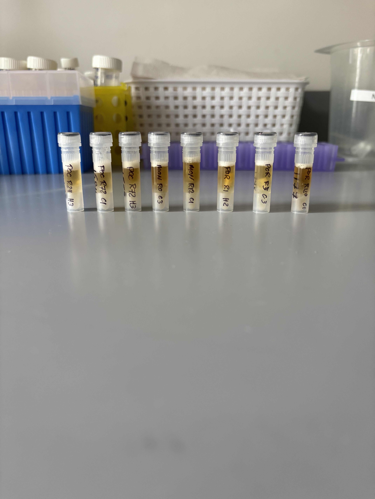
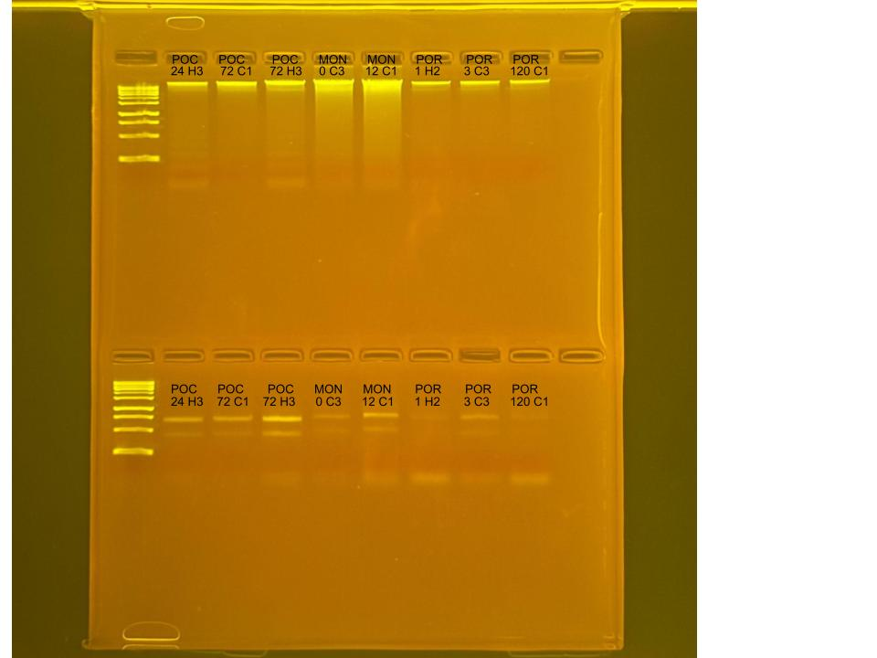

## RNA and DNA extractions for Time Series Project, July 17, 2025

### [Protocol Link](https://github.com/zdellaert/ZD_Putnam_Lab_Notebook/blob/master/protocols/2022-10-03-Protocols_Zymo_Quick_DNA_RNA_Miniprep_Plus.md)

### Extraction of 8 random samples from the Time Series experiment done in June and July of 2025. The samples include all 3 species involved in the experiment.

### Samples

The sample IDs are POC 24 H3, POC 72 C1, POC 72 H3, MON 0 C3, MON 12 C1, POR 1 H2, POR 3 C3, and POR 120 C1.  

 Image taken after bead beating

## Notes

- For sample prep bead beat was used in the original tube and vortexed for 2 minutes. 
    - Montipora samples were bead beat for 4 minutes
- Increased Pro K digestion time to 30 mins for all samples 
- Eluted to 80 uL 

## Qubit Results

- Used Broad range dsDNA and RNA Qubit Protocol [HERE](https://zdellaert.github.io/ZD_Putnam_Lab_Notebook/Qubit-Protocol/) 
- All samples read twice, standard only read once

DNA Standards: 180.94 (S1) and 21259.71 (S2)

| colony_id | Species                    | DNA_QBIT_1 | DNA_QBIT_2 | DNA_QBIT_AVG |
|-----------|----------------------------|------------|------------|--------------|
| 24 H3     | *Pocillopora acuta*        |   11.1     | 11.4       |   11.25      |
| 72 C1     | *Pocillopora acuta*        |   16.7     | 17.2       |   16.95      |
| 72 H3     | *Pocillopora acuta*        |   32.4     | 33.2       |   32.8       |
| 0 C3      | *Montipora capitata*       |   56.8     | 57.8       |   57.3       |
| 12 C1     | *Montipora capitata*       |   80.8     | 82.0       |   81.4       |
| 1 H2      | *Porites compressa*        |   9.86     | 9.96       |   9.91       |
| 3 C3      | *Porites compressa*        |   8.30     | 8.28       |   8.29       |
| 120 C1    | *Porites compressa*        |   8.20     | 8.14       |   8.17       |

RNA Standards: 384.30 (S1) and 8207.91 (S2)

| colony_id | Species                    | RNA_QBIT_1 | RNA_QBIT_2 | RNA_QBIT_AVG |
|-----------|----------------------------|------------|------------|--------------|
| 24 H3     | *Pocillopora acuta*        |   14.6     | 15.2       |   14.9       |
| 72 C1     | *Pocillopora acuta*        |   12.8     | 13.2       |   13.0       |
| 72 H3     | *Pocillopora acuta*        |   23.0     | 23.6       |   23.3       |
| 0 C3      | *Montipora capitata*       |     -      | 10.4       |   10.4       |
| 12 C1     | *Montipora capitata*       |   13.2     | 13.8       |   13.5       |
| 1 H2      | *Porites compressa*        |   14.4     | 15.0       |   14.7       |
| 3 C3      | *Porites compressa*        |   14.8     | 14.8       |   14.8       |
| 120 C1    | *Porites compressa*        |   16.8     | 16.6       |   16.7       |

- DNA samples in -20 freezer, RNA samples in -80 freezer

## DNA and RNA Quality Check gel

Ran at 80 volts for 45 minutes

