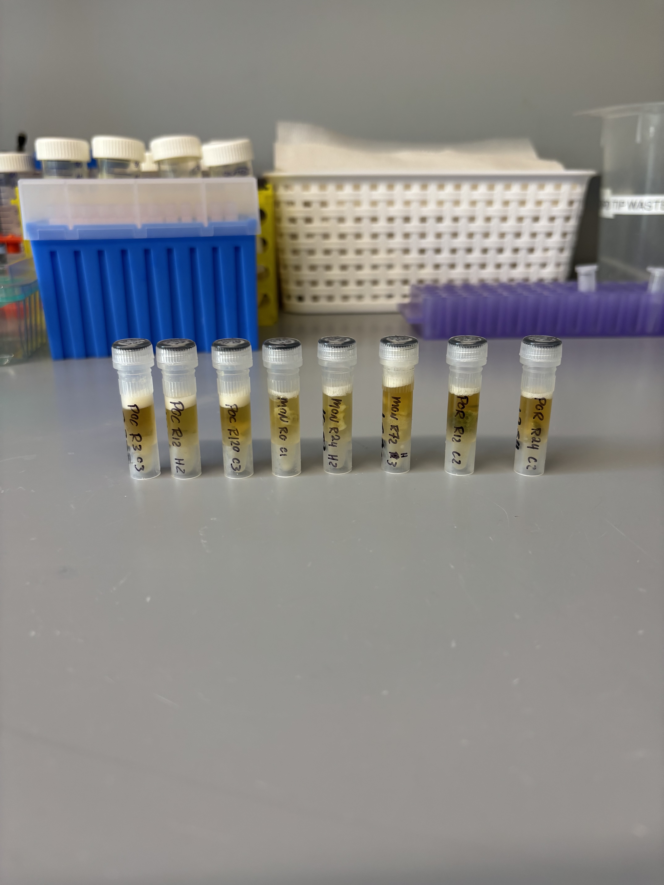
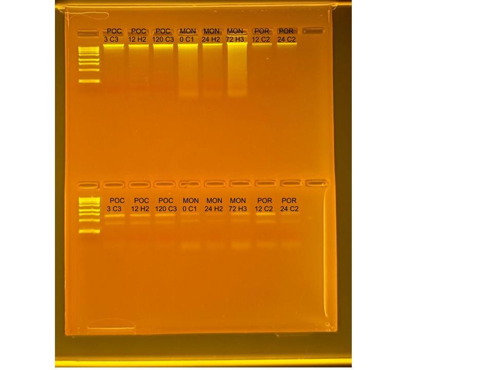

## RNA and DNA extractions for Time Series Project, July 21, 2025

### [Protocol Link](https://github.com/zdellaert/ZD_Putnam_Lab_Notebook/blob/master/protocols/2022-10-03-Protocols_Zymo_Quick_DNA_RNA_Miniprep_Plus.md)

### Extraction of 8 random samples from the Time Series experiment done in June and July of 2025. The samples include all 3 species involved in the experiment.

### Samples

The sample IDs are POC 3 C3, POC 12 H2, POC 120 C3, MON 0 C1, MON 24 H2, MON 72 H3, POR 12 C2, and POR 24 C2.  

 Image taken after bead beating

## Notes

- For sample prep bead beat was used in the original tube and vortexed for 2 minutes. 
    - Montipora samples were bead beat for 4 minutes
- Increased Pro K digestion time to 30 mins for all samples 
- Eluted to 80 uL 
    - Montipora RNA samples eluted to 60 uL

## Qubit Results

- Used Broad range dsDNA and RNA Qubit Protocol [HERE](https://zdellaert.github.io/ZD_Putnam_Lab_Notebook/Qubit-Protocol/) 
- All samples read twice, standard only read once

DNA Standards: 183.83 (S1) and 24052.29 (S2)

| colony_id | Species                    | DNA_QBIT_1 | DNA_QBIT_2 | DNA_QBIT_AVG |
|-----------|----------------------------|------------|------------|--------------|
| 3 C3      | *Pocillopora acuta*        |   25.4     | 24.0       |   23.7       |
| 12 H2     | *Pocillopora acuta*        |   17.6     | 18.2       |   17.9       |
| 120 C3    | *Pocillopora acuta*        |   27.4     | 28.4       |   27.9       |
| 0 C1      | *Montipora capitata*       |   49.2     | 50.4       |   49.8       |
| 24 H2     | *Montipora capitata*       |   22.2     | 23.0       |   22.6       |
| 72 H3     | *Montipora capitata*       |   89.0     | 91.6       |   90.3       |
| 12 C2     | *Porites compressa*        |   6.92     | 6.98       |   6.95       |
| 24 C2     | *Porites compressa*        |   8.42     | 8.44       |   8.43       |

RNA Standards: 393.64 (S1) and 8410.93 (S2)

| colony_id | Species                    | RNA_QBIT_1 | RNA_QBIT_2 | RNA_QBIT_AVG |
|-----------|----------------------------|------------|------------|--------------|
| 3 C3      | *Pocillopora acuta*        |   17.4     | 17.7       |   17.7       |
| 12 H2     | *Pocillopora acuta*        |   11.8     | 11.8       |   11.8       |
| 120 C3    | *Pocillopora acuta*        |   14.4     | 15.0       |   14.7       |
| 0 C1      | *Montipora capitata*       |     -      | 10.2       |   10.2       |
| 24 H2     | *Montipora capitata*       |     -      |   -        |     -        |
| 72 H3     | *Montipora capitata*       |   12.6     | 13.4       |   13.0       |
| 12 C2     | *Porites compressa*        |   22.8     | 22.6       |   22.7       |
| 24 C2     | *Porites compressa*        |   17.6     | 17.6       |   17.6       |

- DNA samples in -20 freezer, RNA samples in -80 freezer

## DNA and RNA Quality Check gel

Ran at 80 volts for 45 minutes

s