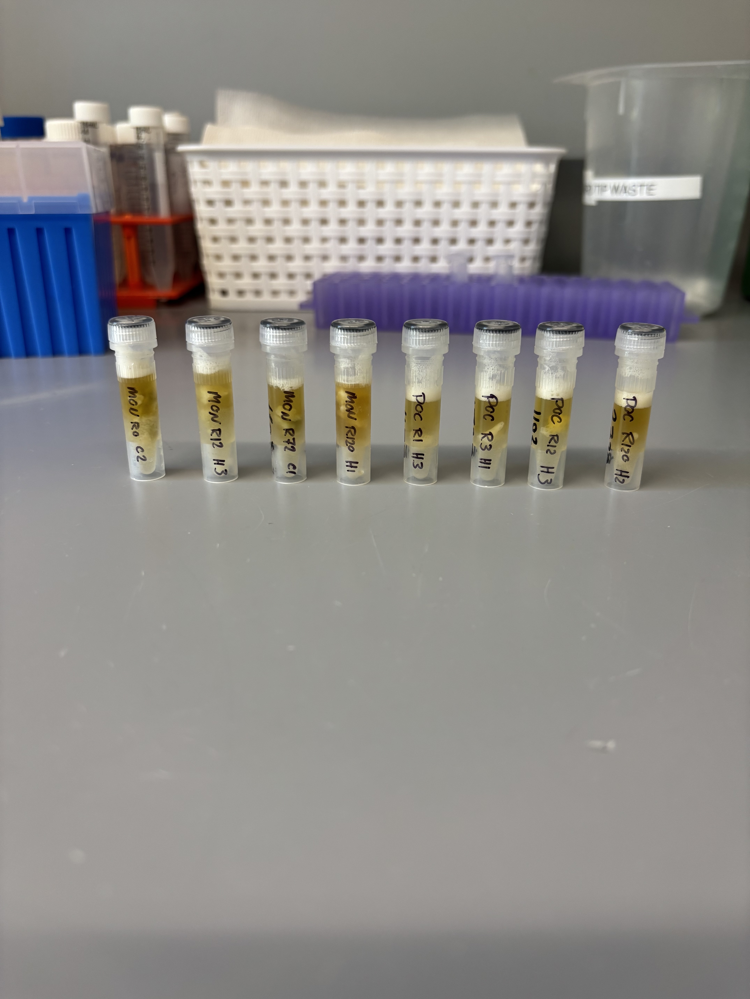

## RNA and DNA extractions for Time Series Project, July 22, 2025

### [Protocol Link](https://github.com/zdellaert/ZD_Putnam_Lab_Notebook/blob/master/protocols/2022-10-03-Protocols_Zymo_Quick_DNA_RNA_Miniprep_Plus.md)

### Extraction of 8 random samples from the Time Series experiment done in June and July of 2025. The samples are only Montipora and Pocillopora.

### Samples

The sample IDs are MON 0 C2, MON 12 H3, MON 72 C1, MON 120 H1, POC 1 H3, POC 3 H1, POC 12 H3, and POC 120 H2.  

 Image taken after bead beating

## Notes

- For sample prep bead beat was used in the original tube and vortexed for 2 minutes. 
    - Montipora samples were bead beat for 4 minutes
- Increased Pro K digestion time to 30 mins for all samples 
- Eluted to 80 uL 
    - Montipora RNA samples eluted to 60 uL

## Qubit Results

- Used Broad range dsDNA and RNA Qubit Protocol [HERE](https://zdellaert.github.io/ZD_Putnam_Lab_Notebook/Qubit-Protocol/) 
- All samples read twice, standard only read once

DNA Standards: 184.60 (S1) and 23345.61 (S2)

| colony_id | Species                    | DNA_QBIT_1 | DNA_QBIT_2 | DNA_QBIT_AVG |
|-----------|----------------------------|------------|------------|--------------|
| 0 C2      | *Montipora capitata*       |   37.6     | 39.2       |   38.4       |
| 12 H3     | *Montipora capitata*       |   68.2     | 71.6       |   69.9       |
| 72 C1     | *Montipora capitata*       |   41.2     | 43.6       |   42.4       |
| 120 H1    | *Montipora capitata*       |   63.2     | 61.6       |   62.4       |
| 1 H3      | *Pocillopora acuta*        |   14.7     | 15.7       |   15.2       |
| 3 H1      | *Pocillopora acuta*        |   31.2     | 32.6       |   31.9       |
| 12 H3     | *Pocillopora acuta*        |   26.0     | 26.0       |   26.0       |
| 120 H2    | *Pocillopora acuta*        |   26.0     | 26.0       |   26.0       |

RNA Standards: 388.98 (S1) and 8083.73 (S2)

| colony_id | Species                    | RNA_QBIT_1 | RNA_QBIT_2 | RNA_QBIT_AVG |
|-----------|----------------------------|------------|------------|--------------|
| 0 C2      | *Montipora capitata*       |   15.0     | 15.8       |   15.4       |
| 12 H3     | *Montipora capitata*       |   15.2     | 16.4       |   15.8       |
| 72 C1     | *Montipora capitata*       |     -      |   -        |     -        |
| 120 H1    | *Montipora capitata*       |   15.8     | 16.0       |   15.9       |
| 1 H3      | *Pocillopora acuta*        |   13.8     | 14.0       |   13.9       |
| 3 H1      | *Pocillopora acuta*        |   14.0     | 14.6       |   14.3       |
| 12 H3     | *Pocillopora acuta*        |   14.0     | 13.8       |   13.9       |
| 120 H2    | *Pocillopora acuta*        |   17.8     | 17.4       |   17.6       |

- DNA samples in -20 freezer, RNA samples in -80 freezer

## DNA and RNA Quality Check gel

Ran at 80 volts for 45 minutes

Note: DNA samples are shifted over a well because of an air bubble in the agarose. 