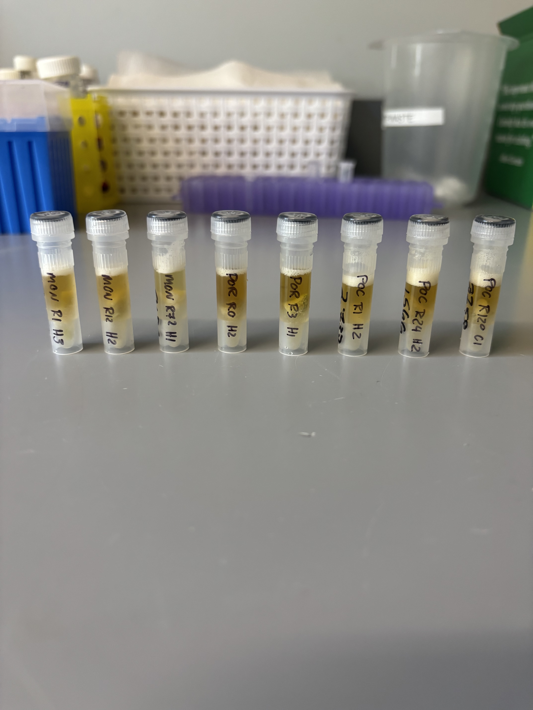
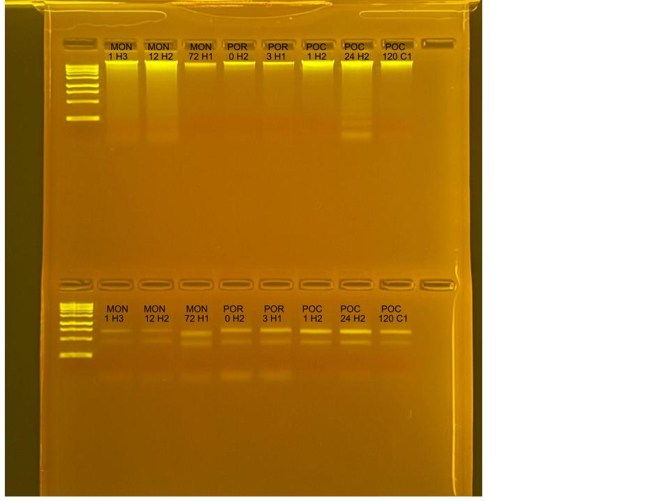

## RNA and DNA extractions for Time Series Project, July 23, 2025

### [Protocol Link](https://github.com/zdellaert/ZD_Putnam_Lab_Notebook/blob/master/protocols/2022-10-03-Protocols_Zymo_Quick_DNA_RNA_Miniprep_Plus.md)

### Extraction of 8 random samples from the Time Series experiment done in June and July of 2025. The samples include all 3 species involved in the experiment.

### Samples

The sample IDs are MON 1 H3, MON 12 H2, MON 72 H1, POR 0 H2, POR 3 H1, POC 1 H2, POC 24 H2, and POC 120 C1.  

 Image taken after bead beating

## Notes

- For sample prep bead beat was used in the original tube and vortexed for 2 minutes. 
    - Montipora samples were bead beat for 4 minutes
- Increased Pro K digestion time to 30 mins for all samples 
- Eluted to 80 uL 
    - Montipora RNA samples eluted to 60 uL

## Qubit Results

- Used Broad range dsDNA and RNA Qubit Protocol [HERE](https://zdellaert.github.io/ZD_Putnam_Lab_Notebook/Qubit-Protocol/) 
- All samples read twice, standard only read once

DNA Standards: 170.53 (S1) and 20067.22 (S2)

| colony_id | Species                    | DNA_QBIT_1 | DNA_QBIT_2 | DNA_QBIT_AVG |
|-----------|----------------------------|------------|------------|--------------|
| 1 H3      | *Montipora capitata*       |   31.2     | 32.6       |   31.9       |
| 12 H2     | *Montipora capitata*       |   46.2     | 47.8       |   47.0       |
| 72 H1     | *Montipora capitata*       |   5.88     | 6.16       |   6.02       |
| 0 H2      | *Porites compressa*        |   12.7     | 13.3       |   13.0       |
| 3 H1      | *Porites compressa*        |   8.54     | 8.96       |   8.75       |
| 1 H2      | *Pocillopora acuta*        |   52.2     | 54.0       |   53.1       |
| 24 H2     | *Pocillopora acuta*        |   48.0     | 47.8       |   47.9       |
| 120 C1    | *Pocillopora acuta*        |   24.2     | 24.4       |   24.3       |

RNA Standards: 372.56 (S1) and 8024.40 (S2)

| colony_id | Species                    | RNA_QBIT_1 | RNA_QBIT_2 | RNA_QBIT_AVG |
|-----------|----------------------------|------------|------------|--------------|
| 1 H3      | *Montipora capitata*       |   10.8     | 11.2       |   11.0       |
| 12 H2     | *Montipora capitata*       |     -      | 10.2       |   10.2       |
| 72 H1     | *Montipora capitata*       |   19.4     | 20.2       |   19.8       |
| 0 H2      | *Porites compressa*        |   23.8     | 24.2       |   24.0       |
| 3 H1      | *Porites compressa*        |   27.2     | 27.8       |   27.5       |
| 1 H2      | *Pocillopora acuta*        |   22.4     | 23.0       |   22.7       |
| 24 H2     | *Pocillopora acuta*        |   30.2     | 30.0       |   30.1       |
| 120 C1    | *Pocillopora acuta*        |   19.8     | 19.4       |   19.6       |

- DNA samples in -20 freezer, RNA samples in -80 freezer

## DNA and RNA Quality Check gel

Ran at 80 volts for 45 minutes

