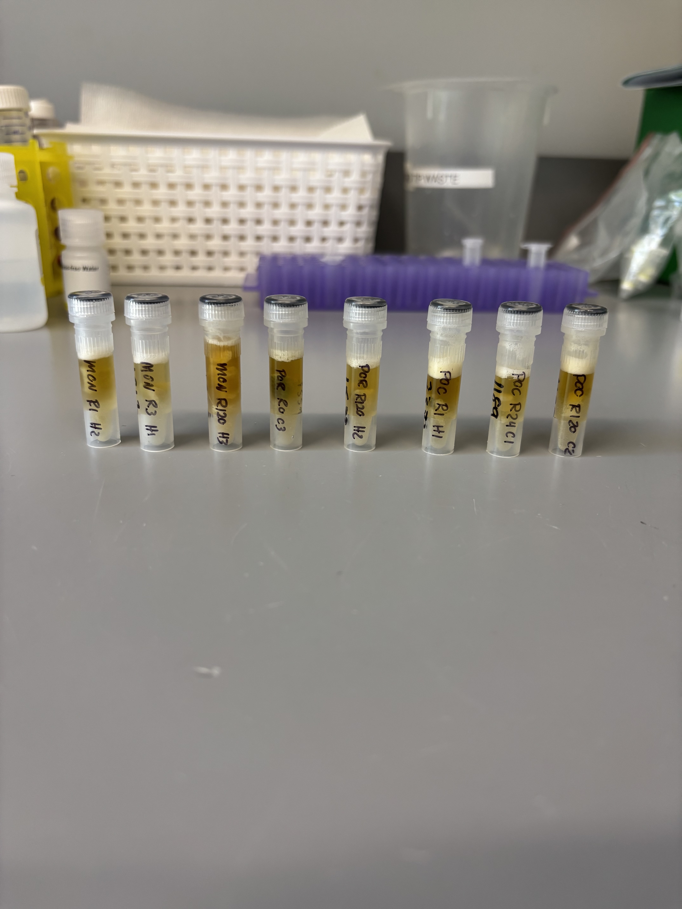
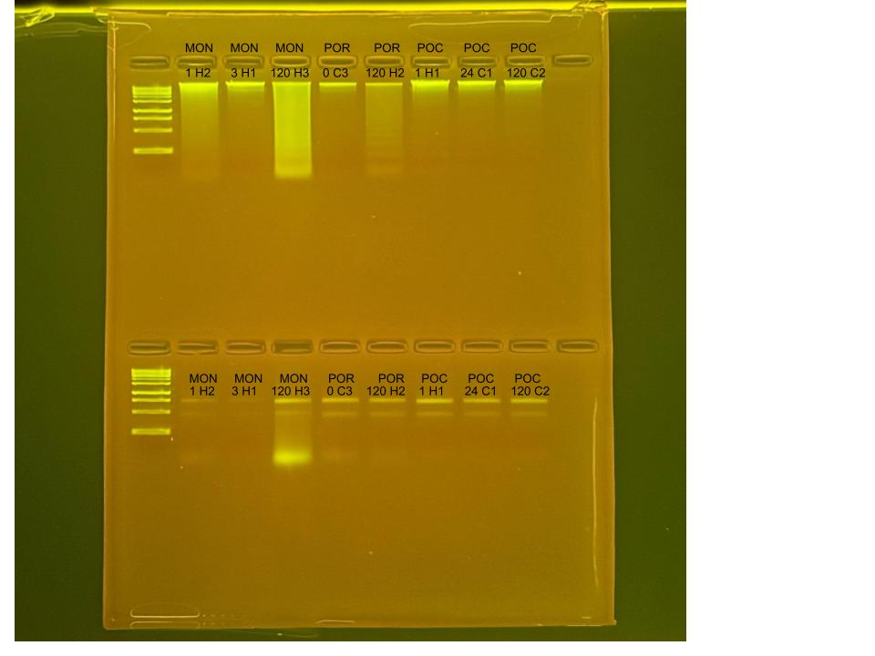

## RNA and DNA extractions for Time Series Project, July 24, 2025

### [Protocol Link](https://github.com/zdellaert/ZD_Putnam_Lab_Notebook/blob/master/protocols/2022-10-03-Protocols_Zymo_Quick_DNA_RNA_Miniprep_Plus.md)

### Extraction of 8 random samples from the Time Series experiment done in June and July of 2025. The samples include all 3 species involved in the experiment.

### Samples

The sample IDs are MON 1 H2, MON 3 H1, MON 120 H3, POR 0 C3, POR 120 H2, POC 1 H1, POC 24 C1, and POC 120 C2.  

 Image taken after bead beating

## Notes

- For sample prep bead beat was used in the original tube and vortexed for 2 minutes. 
    - Montipora samples were bead beat for 4 minutes
- Increased Pro K digestion time to 30 mins for all samples 
- Eluted to 80 uL 
    - Montipora RNA samples eluted to 60 uL

## Qubit Results

- Used Broad range dsDNA and RNA Qubit Protocol [HERE](https://zdellaert.github.io/ZD_Putnam_Lab_Notebook/Qubit-Protocol/) 
- All samples read twice, standard only read once

DNA Standards: 176.50 (S1) and 21036.65 (S2)

| colony_id | Species                    | DNA_QBIT_1 | DNA_QBIT_2 | DNA_QBIT_AVG |
|-----------|----------------------------|------------|------------|--------------|
| 1 H2      | *Montipora capitata*       |   47.2     | 48.8       |   48.0       |
| 3 H1      | *Montipora capitata*       |   35.0     | 35.8       |   35.4       |
| 120 H3    | *Montipora capitata*       |   103      | 106        |   104.5      |
| 0 C3      | *Porites compressa*        |   9.54     | 9.54       |   9.54       |
| 120 H2    | *Porites compressa*        |   12.0     | 12.3       |   12.15      |
| 1 H1      | *Pocillopora acuta*        |   58.4     | 59.4       |   58.9       |
| 24 C1     | *Pocillopora acuta*        |   31.0     | 30.8       |   30.9       |
| 120 C2    | *Pocillopora acuta*        |   38.0     | 38.2       |   38.1       |

RNA Standards: 369.25 (S1) and 7841.87 (S2)

| colony_id | Species                    | RNA_QBIT_1 | RNA_QBIT_2 | RNA_QBIT_AVG |
|-----------|----------------------------|------------|------------|--------------|
| 1 H2      | *Montipora capitata*       |   12.8     | 12.8       |   12.8       |
| 3 H1      | *Montipora capitata*       |     -      |   -        |     -        |
| 120 H3    | *Montipora capitata*       |   30.6     | 31.2       |   30.9       |
| 0 C3      | *Porites compressa*        |   24.6     | 25.2       |   24.9       |
| 120 H2    | *Porites compressa*        |   19.0     | 19.4       |   19.2       |
| 1 H1      | *Pocillopora acuta*        |   24.4     | 24.8       |   24.6       |
| 24 C1     | *Pocillopora acuta*        |   21.0     | 21.0       |   21.0       |
| 120 C2    | *Pocillopora acuta*        |   22.4     | 22.4       |   22.4       |

- DNA samples in -20 freezer, RNA samples in -80 freezer

## DNA and RNA Quality Check gel

Ran at 80 volts for 45 minutes

