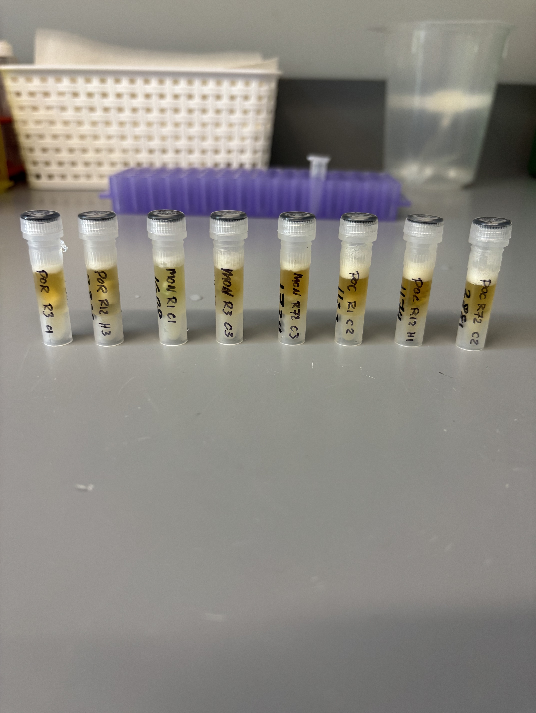
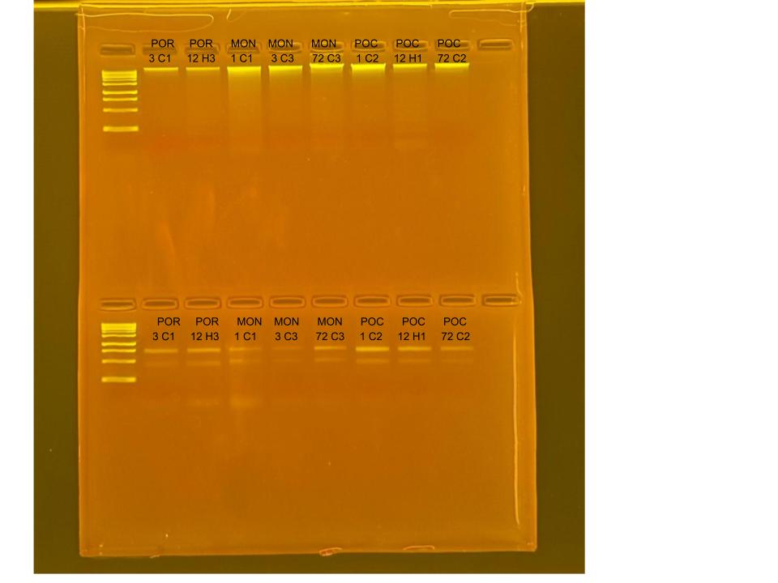

## RNA and DNA extractions for Time Series Project, July 28, 2025

### [Protocol Link](https://github.com/zdellaert/ZD_Putnam_Lab_Notebook/blob/master/protocols/2022-10-03-Protocols_Zymo_Quick_DNA_RNA_Miniprep_Plus.md)

### Extraction of 8 random samples from the Time Series experiment done in June and July of 2025. The samples include all 3 species involved in the experiment.

### Samples

The sample IDs are POR 3 C1, POR 12 H3, MON 1 C1, MON 3 C3, MON 72 C3, POC 1 C2, POC 12 H1, and POC 72 C2.  

 Image taken after bead beating

## Notes

- For sample prep bead beat was used in the original tube and vortexed for 2 minutes. 
    - Montipora samples were bead beat for 4 minutes
- Increased Pro K digestion time to 30 mins for all samples 
- Eluted to 80 uL 
    - Montipora RNA samples eluted to 60 uL
- Saved a 2 uL aliquot of Montipora RNA samples to use for HS RNA Qubit if needed. Aliquots are in the -80 freezer with the rest of the extracted RNA

## Qubit Results

- Used Broad range dsDNA and RNA Qubit Protocol [HERE](https://zdellaert.github.io/ZD_Putnam_Lab_Notebook/Qubit-Protocol/) 
- All samples read twice, standard only read once

DNA Standards: 181.21 (S1) and 21084.94 (S2)

| colony_id | Species                    | DNA_QBIT_1 | DNA_QBIT_2 | DNA_QBIT_AVG |
|-----------|----------------------------|------------|------------|--------------|
| 3 C1      | *Porites compressa*        |   5.96     | 6.24       |   6.10       |
| 12 H3     | *Porites compressa*        |   6.14     | 6.30       |   6.22       |
| 1 C1      | *Montipora capitata*       |   28.4     | 29.4       |   28.9       |
| 3 C3      | *Montipora capitata*       |   22.6     | 23.4       |   23.0       |
| 72 C3     | *Montipora capitata*       |   52.2     | 53.8       |   53.0       |
| 1 C2      | *Pocillopora acuta*        |   53.0     | 54.0       |   53.5       |
| 12 H1     | *Pocillopora acuta*        |   18.1     | 18.1       |   18.1       |
| 72 C2     | *Pocillopora acuta*        |   23.2     | 23.4       |   23.3       |

RNA Standards: 370.03 (S1) and 7784.31 (S2)

| colony_id | Species                    | RNA_QBIT_1 | RNA_QBIT_2 | RNA_QBIT_AVG |
|-----------|----------------------------|------------|------------|--------------|
| 3 C1      | *Porites compressa*        |   21.6     | 22.0       |   21.8       |
| 12 H3     | *Porites compressa*        |   20.8     | 21.2       |   21.0       |
| 1 C1      | *Montipora capitata*       |   12.6     | 13.0       |   12.8       |
| 3 C3      | *Montipora capitata*       |     -      |   -        |     -        |
| 72 C3     | *Montipora capitata*       |   13.0     | 13.4       |   13.2       |
| 1 C2      | *Pocillopora acuta*        |   25.4     | 25.4       |   25.4       |
| 12 H1     | *Pocillopora acuta*        |   20.0     | 20.0       |   20.0       |
| 72 C2     | *Pocillopora acuta*        |   16.6     | 16.6       |   16.6       |

- DNA samples in -20 freezer, RNA samples in -80 freezer

## DNA and RNA Quality Check gel

Ran at 80 volts for 45 minutes

