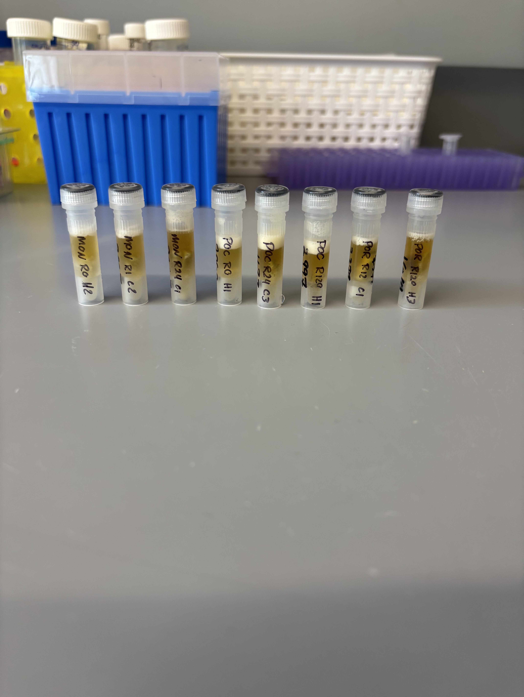
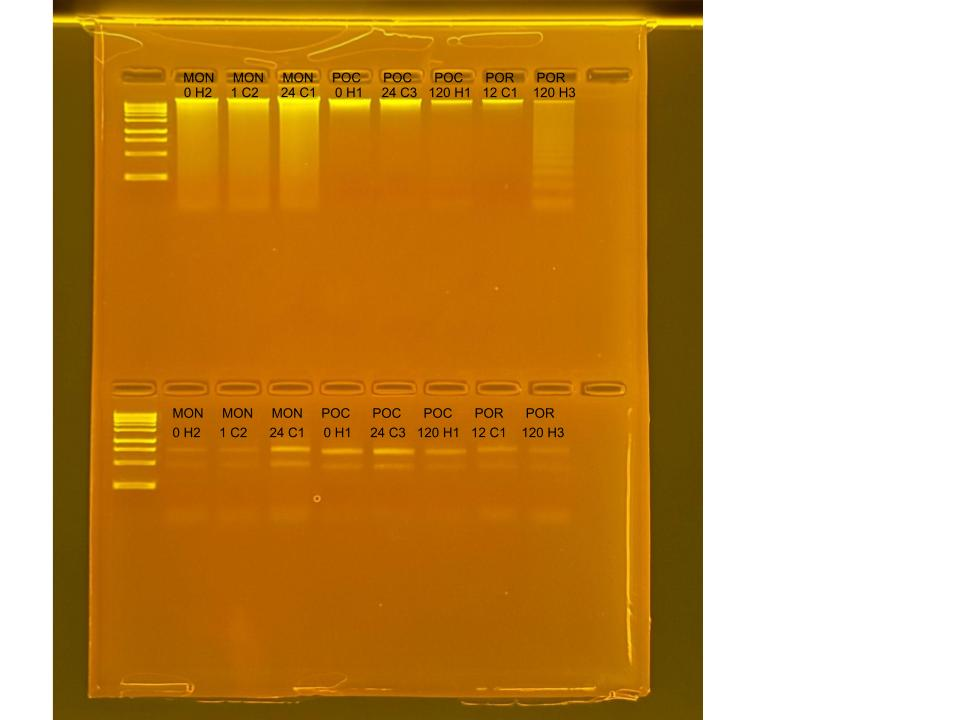

## RNA and DNA extractions for Time Series Project, July 29, 2025

### [Protocol Link](https://github.com/zdellaert/ZD_Putnam_Lab_Notebook/blob/master/protocols/2022-10-03-Protocols_Zymo_Quick_DNA_RNA_Miniprep_Plus.md)

### Extraction of 8 random samples from the Time Series experiment done in June and July of 2025. The samples include all 3 species involved in the experiment.

### Samples

The sample IDs are MON 0 H2, MON 1 C2, MON 24 C1, POC 0 H1, POC 24 C3, POC 120 H1, POR 12 C1, and POR 120 H3.  

 Image taken after bead beating

## Notes

- For sample prep bead beat was used in the original tube and vortexed for 2 minutes. 
    - Montipora samples were bead beat for 4 minutes
- Increased Pro K digestion time to 30 mins for all samples 
- Eluted to 80 uL 
    - Montipora RNA samples eluted to 60 uL
- Saved a 2 uL aliquot of Montipora RNA samples to use for HS RNA Qubit if needed. Aliquots are in the -80 freezer with the rest of the extracted RNA

## Qubit Results

- Used Broad range dsDNA and RNA Qubit Protocol [HERE](https://zdellaert.github.io/ZD_Putnam_Lab_Notebook/Qubit-Protocol/) 
- All samples read twice, standard only read once

DNA Standards: 173.25 (S1) and 20553.99 (S2)

| colony_id | Species                    | DNA_QBIT_1 | DNA_QBIT_2 | DNA_QBIT_AVG |
|-----------|----------------------------|------------|------------|--------------|
| 0 H2      | *Montipora capitata*       |   49.0     | 50.2       |   49.6       |
| 1 C2      | *Montipora capitata*       |   40.0     | 41.4       |   40.7       |
| 24 C1     | *Montipora capitata*       |   101      | 103        |   102        |
| 0 H1      | *Pocillopora acuta*        |   31.0     | 32.2       |   31.6       |
| 24 C3     | *Pocillopora acuta*        |   34.0     | 34.6       |   34.3       |
| 120 H1    | *Pocillopora acuta*        |   8.52     | 8.76       |   8.64       |
| 12 C1     | *Porites compressa*        |   9.28     | 9.32       |   9.30       |
| 120 H3    | *Porites compressa*        |   13.3     | 13.3       |   13.3       |

RNA Standards: 368.19 (S1) and 7676.14 (S2)

| colony_id | Species                    | RNA_QBIT_1 | RNA_QBIT_2 | RNA_QBIT_AVG |
|-----------|----------------------------|------------|------------|--------------|
| 0 H2      | *Montipora capitata*       |   11.0     | 11.4       |   11.2       |
| 1 C2      | *Montipora capitata*       |   10.0     | 10.4       |   10.2       |
| 24 C1     | *Montipora capitata*       |   22.6     | 23.2       |   22.9       |
| 0 H1      | *Pocillopora acuta*        |   24.0     | 23.8       |   23.9       |
| 24 C3     | *Pocillopora acuta*        |   28.6     | 28.8       |   28.7       |
| 120 H1    | *Pocillopora acuta*        |   16.2     | 16.6       |   16.4       |
| 12 C1     | *Porites compressa*        |   25.0     | 24.4       |   24.7       |
| 120 H3    | *Porites compressa*        |   23.0     | 23.8       |   23.4       |

- DNA samples in -20 freezer, RNA samples in -80 freezer

## DNA and RNA Quality Check gel

Ran at 80 volts for 45 minutes

