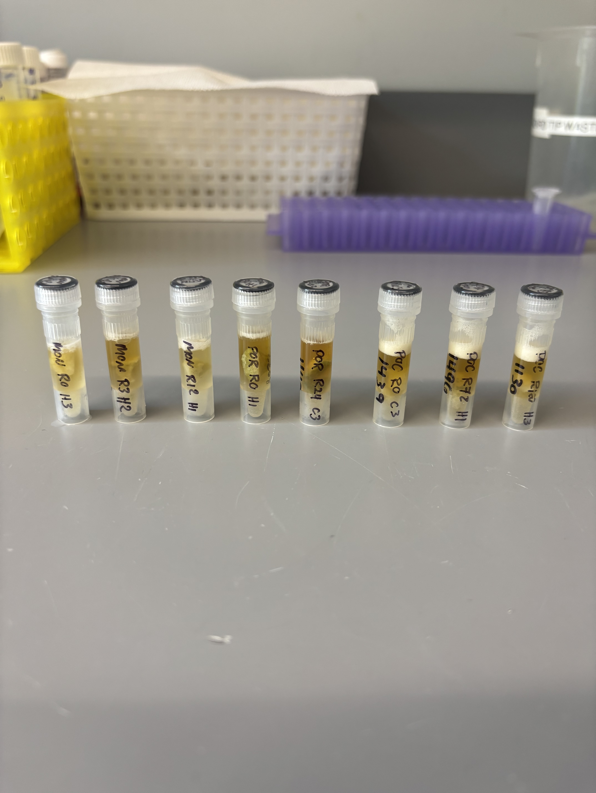
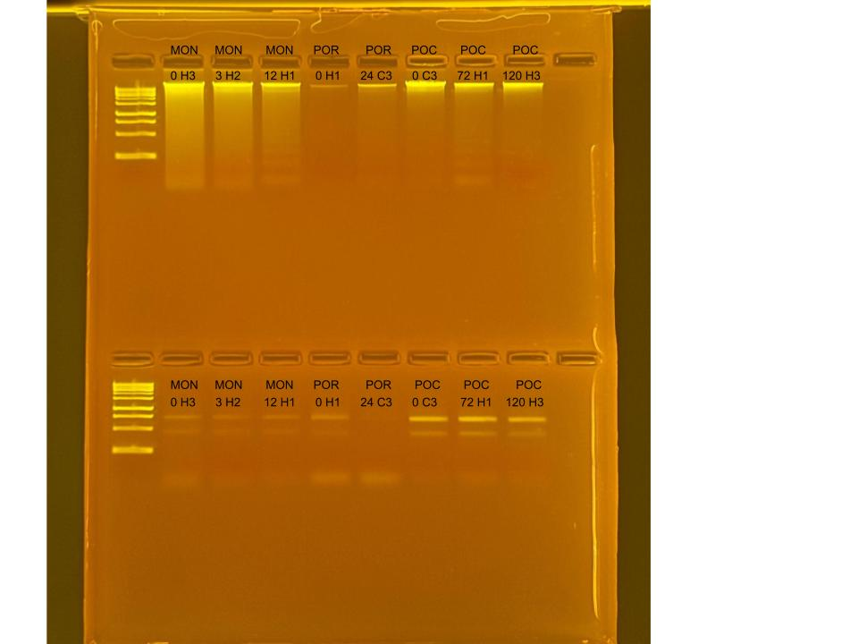

## RNA and DNA extractions for Time Series Project, July 31, 2025

### [Protocol Link](https://github.com/zdellaert/ZD_Putnam_Lab_Notebook/blob/master/protocols/2022-10-03-Protocols_Zymo_Quick_DNA_RNA_Miniprep_Plus.md)

### Extraction of 8 random samples from the Time Series experiment done in June and July of 2025. The samples include all 3 species involved in the experiment.

### Samples

The sample IDs are MON 0 H3, MON 3 H2, MON 12 H1, POR 0 H1, POR 24 C3, POC 0 C3, POC 72 H1, and POC 120 H3.  

 Image taken after bead beating

## Notes

- For sample prep bead beat was used in the original tube and vortexed for 2 minutes. 
    - Montipora samples were bead beat for 4 minutes
- Increased Pro K digestion time to 30 mins for all samples 
- Eluted to 80 uL 
    - Montipora RNA samples eluted to 60 uL
- Saved a 2 uL aliquot of Montipora RNA samples to use for HS RNA Qubit if needed. Aliquots are in the -80 freezer with the rest of the extracted RNA

## Qubit Results

- Used Broad range dsDNA and RNA Qubit Protocol [HERE](https://zdellaert.github.io/ZD_Putnam_Lab_Notebook/Qubit-Protocol/) 
- All samples read twice, standard only read once

DNA Standards: 182.37 (S1) and 20767.40 (S2)

| colony_id | Species                    | DNA_QBIT_1 | DNA_QBIT_2 | DNA_QBIT_AVG |
|-----------|----------------------------|------------|------------|--------------|
| 0 H3      | *Montipora capitata*       |   80.2     | 82.2       |   81.2       |
| 3 H2      | *Montipora capitata*       |   49.4     | 50.2       |   49.8       |
| 12 H1     | *Montipora capitata*       |   31.4     | 32.0       |   31.7       |
| 0 H1      | *Porites compressa*        |     -      |   -        |     -        |
| 24 C3     | *Porites compressa*        |   6.48     | 6.68       |   6.58       |
| 0 C3      | *Pocillopora acuta*        |   52.2     | 53.0       |   52.6       |
| 72 H1     | *Pocillopora acuta*        |   24.0     | 23.6       |   23.8       |
| 120 H3    | *Pocillopora acuta*        |   25.0     | 24.8       |   24.9       |

RNA Standards: 378.40 (S1) and 7782.85 (S2)

| colony_id | Species                    | RNA_QBIT_1 | RNA_QBIT_2 | RNA_QBIT_AVG |
|-----------|----------------------------|------------|------------|--------------|
| 0 H3      | *Montipora capitata*       |   11.8     | 12.6       |   12.2       |
| 3 H2      | *Montipora capitata*       |     -      | 10.0       |   10.0       |
| 12 H1     | *Montipora capitata*       |     -      |   -        |     -        |
| 0 H1      | *Porites compressa*        |   20.2     | 20.8       |   20.5       |
| 24 C3     | *Porites compressa*        |   13.6     | 14.2       |   13.9       |
| 0 C3      | *Pocillopora acuta*        |   23.2     | 23.4       |   23.3       |
| 72 H1     | *Pocillopora acuta*        |   29.0     | 28.8       |   28.9       |
| 120 H3    | *Pocillopora acuta*        |   22.2     | 21.8       |   22.0       |

- DNA samples in -20 freezer, RNA samples in -80 freezer

## DNA and RNA Quality Check gel

Ran at 80 volts for 45 minutes

