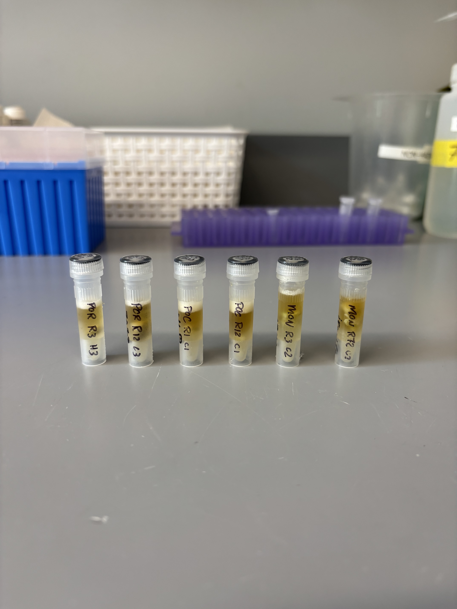
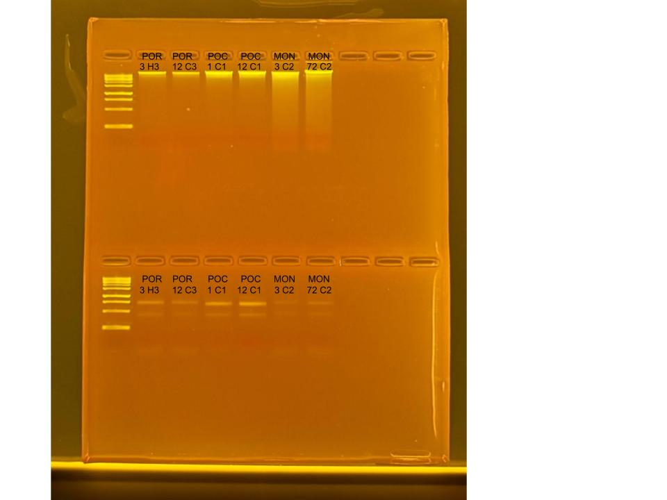

## RNA and DNA extractions for Time Series Project, August 4, 2025

### [Protocol Link](https://github.com/zdellaert/ZD_Putnam_Lab_Notebook/blob/master/protocols/2022-10-03-Protocols_Zymo_Quick_DNA_RNA_Miniprep_Plus.md)

### Extraction of 6 random samples from the Time Series experiment done in June and July of 2025. The samples include all 3 species involved in the experiment.

### Samples

The sample IDs are POR 3 H3, POR 12 C3, POC 1 C1, POC 12 C1, MON 3 C2, and MON 72 C2.

 Image taken after bead beating

## Notes

- For sample prep bead beat was used in the original tube and vortexed for 2 minutes. 
    - Montipora samples were bead beat for 4 minutes
- Increased Pro K digestion time to 30 mins for all samples 
- Eluted to 80 uL 
    - Montipora RNA samples eluted to 60 uL
- Saved a 2 uL aliquot of Montipora RNA samples to use for HS RNA Qubit if needed. Aliquots are in the -80 freezer with the rest of the extracted RNA

## Qubit Results

- Used Broad range dsDNA and RNA Qubit Protocol [HERE](https://zdellaert.github.io/ZD_Putnam_Lab_Notebook/Qubit-Protocol/) 
- All samples read twice, standard only read once

DNA Standards: 164.50 (S1) and 18148.14 (S2)

| colony_id | Species                    | DNA_QBIT_1 | DNA_QBIT_2 | DNA_QBIT_AVG |
|-----------|----------------------------|------------|------------|--------------|
| 3 H3      | *Porites compressa*        |   11.2     | 11.8       |   11.5       |
| 12 C3     | *Porites compressa*        |   7.38     | 7.88       |   7.63       |
| 1 C1      | *Pocillopora acuta*        |   26.8     | 28.2       |   27.5       |
| 12 C1     | *Pocillopora acuta*        |   40.8     | 42.8       |   41.8       |
| 3 C2      | *Montipora capitata*       |   52.2     | 54.6       |   53.4       |
| 72 C2     | *Montipora capitata*       |   79.6     | 83.2       |   81.4       |

RNA Standards: 359.14 (S1) and 7582.77 (S2)

| colony_id | Species                    | RNA_QBIT_1 | RNA_QBIT_2 | RNA_QBIT_AVG |
|-----------|----------------------------|------------|------------|--------------|
| 3 H3      | *Porites compressa*        |   19.8     | 20.2       |   20.0       |
| 12 C3     | *Porites compressa*        |   18.2     | 18.8       |   18.5       |
| 1 C1      | *Pocillopora acuta*        |   19.4     | 19.6       |   19.5       |
| 12 C1     | *Pocillopora acuta*        |   23.8     | 24.5       |   24.2       |
| 3 C2      | *Montipora capitata*       |     -      | 10.2       |   10.2       |
| 72 C2     | *Montipora capitata*       |   11.8     | 11.8       |   11.8       |

- DNA samples in -20 freezer, RNA samples in -80 freezer

## DNA and RNA Quality Check gel

Ran at 80 volts for 45 minutes

