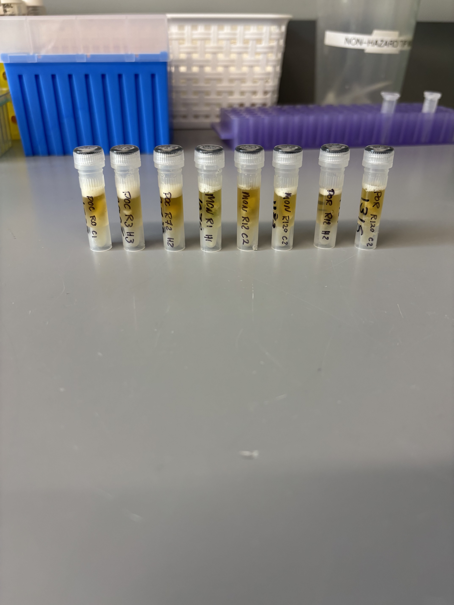

## RNA and DNA extractions for Time Series Project, August 5, 2025

### [Protocol Link](https://github.com/zdellaert/ZD_Putnam_Lab_Notebook/blob/master/protocols/2022-10-03-Protocols_Zymo_Quick_DNA_RNA_Miniprep_Plus.md)

### Extraction of 8 random samples from the Time Series experiment done in June and July of 2025. The samples include all 3 species involved in the experiment.

### Samples

The sample IDs are POC 0 C1, POC 3 H3, POC 72 H2, MON 1 H1, MON 12 C2, MON 120 C2, POR 12 H2, and POR 120 C2.

 Image taken after bead beating

## Notes

- For sample prep bead beat was used in the original tube and vortexed for 2 minutes. 
    - Montipora samples were bead beat for 4 minutes
- Increased Pro K digestion time to 30 mins for all samples 
- Eluted to 80 uL 
    - Montipora RNA samples eluted to 60 uL
    - DNA of sample POC 3 H3 was accidentally eluted to 110 uL
- Saved a 2 uL aliquot of Montipora RNA samples to use for HS RNA Qubit if needed. Aliquots are in the -80 freezer with the rest of the extracted RNA

## Qubit Results

- Used Broad range dsDNA and RNA Qubit Protocol [HERE](https://zdellaert.github.io/ZD_Putnam_Lab_Notebook/Qubit-Protocol/) 
- All samples read twice, standard only read once

DNA Standards: 182.38 (S1) and 21592.29 (S2)

| colony_id | Species                    | DNA_QBIT_1 | DNA_QBIT_2 | DNA_QBIT_AVG |
|-----------|----------------------------|------------|------------|--------------|
| 0 C1      | *Pocillopora acuta*        |   80.2     | 81.2       |   80.7       |
| 3 H3      | *Pocillopora acuta*        |   9.04     | 9.14       |   9.09       |
| 72 H2     | *Pocillopora acuta*        |   29.6     | 30.0       |   29.8       |
| 1 H1      | *Montipora capitata*       |   25.6     | 26.0       |   25.8       |
| 12 C2     | *Montipora capitata*       |   97.6     | 99.0       |   98.3       |
| 120 C2    | *Montipora capitata*       |   36.8     | 37.2       |   37.0       |
| 12 H2     | *Porites compressa*        |   3.84     | 3.70       |   3.77       |
| 120 C2    | *Porites compressa*        |   3.94     | 3.92       |   3.93       |

RNA Standards: 374.74  (S1) and 7761.36 (S2)

| colony_id | Species                    | RNA_QBIT_1 | RNA_QBIT_2 | RNA_QBIT_AVG |
|-----------|----------------------------|------------|------------|--------------|
| 0 C1      | *Pocillopora acuta*        |   26.2     | 26.4       |   26.3       |
| 3 H3      | *Pocillopora acuta*        |   13.8     | 14.0       |   13.9       |
| 72 H2     | *Pocillopora acuta*        |   26.2     | 26.0       |   26.1       |
| 1 H1      | *Montipora capitata*       |     -      |   -        |     -        |
| 12 C2     | *Montipora capitata*       |   13.6     | 13.8       |   13.7       |
| 120 C2    | *Montipora capitata*       |     -      |   -        |     -        |
| 12 H2     | *Porites compressa*        |   18.6     | 18.4       |   18.5       |
| 120 C2    | *Porites compressa*        |   21.0     | 20.6       |   20.8       |

- DNA samples in -20 freezer, RNA samples in -80 freezer

## DNA and RNA Quality Check gel

Ran at 80 volts for 45 minutes

