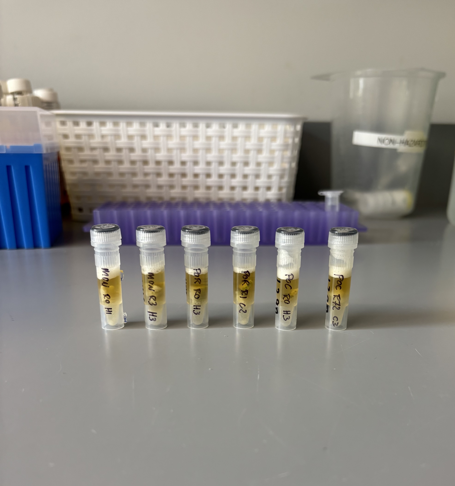
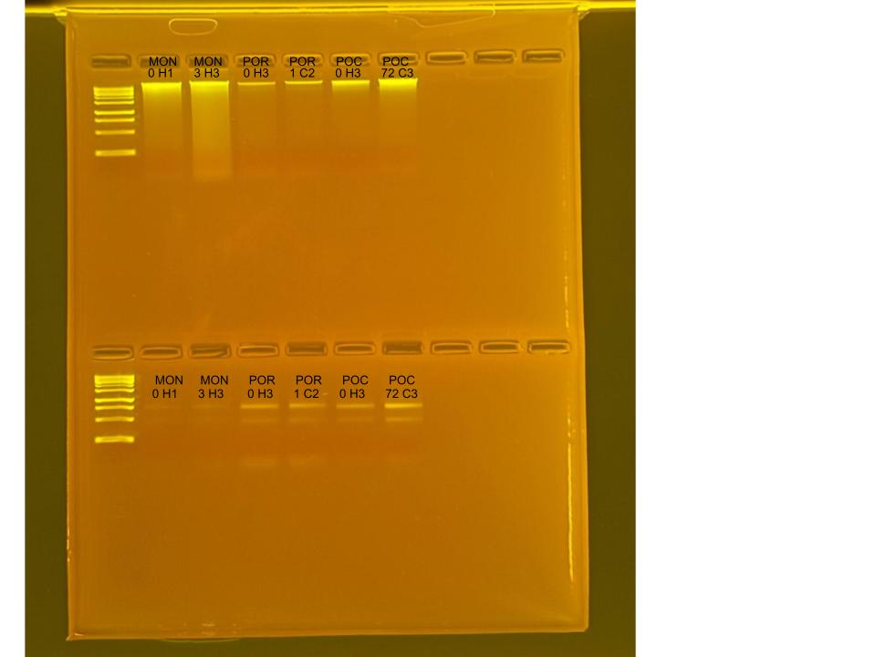

## RNA and DNA extractions for Time Series Project, August 6, 2025

### [Protocol Link](https://github.com/zdellaert/ZD_Putnam_Lab_Notebook/blob/master/protocols/2022-10-03-Protocols_Zymo_Quick_DNA_RNA_Miniprep_Plus.md)

### Extraction of 6 random samples from the Time Series experiment done in June and July of 2025. The samples include all 3 species involved in the experiment.

### Samples

The sample IDs are MON 0 H1, MON 3 H3, POR 0 H3, POR 1 C2, POC 0 H3, and POC 72 C3.

 Image taken after bead beating

## Notes

- For sample prep bead beat was used in the original tube and vortexed for 2 minutes. 
    - Montipora samples were bead beat for 4 minutes
- Increased Pro K digestion time to 30 mins for all samples 
- Eluted to 80 uL 
    - Montipora RNA samples eluted to 60 uL
- Saved a 2 uL aliquot of Montipora RNA samples to use for HS RNA Qubit if needed. Aliquots are in the -80 freezer with the rest of the extracted RNA

## Qubit Results

- Used Broad range dsDNA and RNA Qubit Protocol [HERE](https://zdellaert.github.io/ZD_Putnam_Lab_Notebook/Qubit-Protocol/) 
- All samples read twice, standard only read once

DNA Standards: 175.53 (S1) and 21252.93 (S2)

| colony_id | Species                    | DNA_QBIT_1 | DNA_QBIT_2 | DNA_QBIT_AVG |
|-----------|----------------------------|------------|------------|--------------|
| 0 H1      | *Montipora capitata*       |   33.8     | 34.6       |   34.2       |
| 3 H3      | *Montipora capitata*       |   44.4     | 45.2       |   44.8       |
| 0 H3      | *Porites compressa*        |   4.94     | 4.96       |   4.95       |
| 1 C2      | *Porites compressa*        |   5.02     | 5.12       |   5.07       |
| 0 H3      | *Pocillopora acuta*        |   11.7     | 11.9       |   11.8       |
| 72 C3     | *Pocillopora acuta*        |   49.0     | 49.2       |   49.1       |

RNA Standards: 372.69 (S1) and 7946.32 (S2)

| colony_id | Species                    | RNA_QBIT_1 | RNA_QBIT_2 | RNA_QBIT_AVG |
|-----------|----------------------------|------------|------------|--------------|
| 0 H1      | *Montipora capitata*       |     -      |   -        |     -        |
| 3 H3      | *Montipora capitata*       |     -      |   -        |     -        |
| 0 H3      | *Porites compressa*        |   22.0     | 22.2       |   22.1       |
| 1 C2      | *Porites compressa*        |   18.0     | 18.0       |   18.0       |
| 0 H3      | *Pocillopora acuta*        |   11.4     | 11.4       |   11.4       |
| 72 C3     | *Pocillopora acuta*        |   22.4     | 22.4       |   22.4       |

- DNA samples in -20 freezer, RNA samples in -80 freezer

## DNA and RNA Quality Check gel

Ran at 80 volts for 45 minutes

