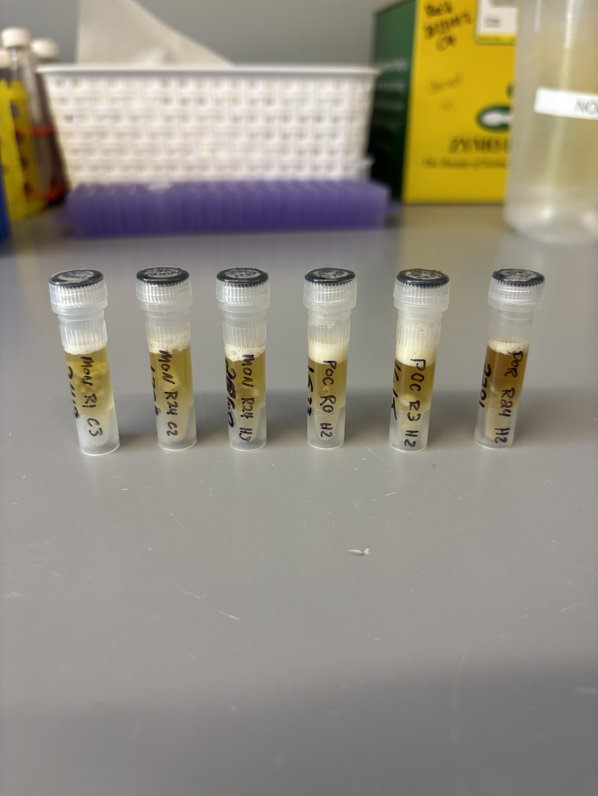
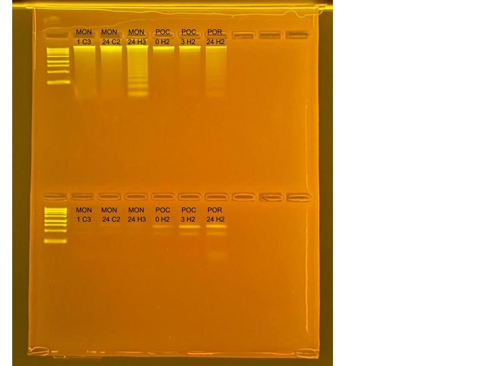

## RNA and DNA extractions for Time Series Project, August 7, 2025

### [Protocol Link](https://github.com/zdellaert/ZD_Putnam_Lab_Notebook/blob/master/protocols/2022-10-03-Protocols_Zymo_Quick_DNA_RNA_Miniprep_Plus.md)

### Extraction of 6 random samples from the Time Series experiment done in June and July of 2025. The samples include all 3 species involved in the experiment.

### Samples

The sample IDs are MON 1 C3, MON 24 C2, MON 24 H3, POC 0 H2, POC 3 H2, and POR 24 H2.

 Image taken after bead beating

## Notes

- For sample prep bead beat was used in the original tube and vortexed for 2 minutes. 
    - Montipora samples were bead beat for 4 minutes
- Increased Pro K digestion time to 30 mins for all samples 
- Eluted to 80 uL 
    - Montipora RNA samples eluted to 60 uL
- Saved a 2 uL aliquot of Montipora RNA samples to use for HS RNA Qubit if needed. Aliquots are in the -80 freezer with the rest of the extracted RNA

## Qubit Results

- Used Broad range dsDNA and RNA Qubit Protocol [HERE](https://zdellaert.github.io/ZD_Putnam_Lab_Notebook/Qubit-Protocol/) 
- All samples read twice, standard only read once

DNA Standards: 174.76 (S1) and 21199.93 (S2)

| colony_id | Species                    | DNA_QBIT_1 | DNA_QBIT_2 | DNA_QBIT_AVG |
|-----------|----------------------------|------------|------------|--------------|
| 1 C3      | *Montipora capitata*       |   28.8     | 29.2       |   29.0       |
| 24 C2     | *Montipora capitata*       |   52.0     | 52.4       |   52.2       |
| 24 H3     | *Montipora capitata*       |   79.2     | 80.8       |   80.0       |
| 0 H2      | *Pocillopora acuta*        |   17.0     | 17.0       |   17.0       |
| 3 H2      | *Pocillopora acuta*        |   28.2     | 28.8       |   28.5       |
| 24 H2     | *Porites compressa*        |   16.8     | 17.5       |   17.15      |

RNA Standards: 375.35 (S1) and 7897.02 (S2)

| colony_id | Species                    | RNA_QBIT_1 | RNA_QBIT_2 | RNA_QBIT_AVG |
|-----------|----------------------------|------------|------------|--------------|
| 1 C3      | *Montipora capitata*       |     -      |   -        |     -        |
| 24 C2     | *Montipora capitata*       |     -      |   -        |     -        |
| 24 H3     | *Montipora capitata*       |     -      |   -        |     -        |
| 0 H2      | *Pocillopora acuta*        |     -      | 10.0       |   10.0       |
| 3 H2      | *Pocillopora acuta*        |   17.2     | 17.4       |   17.3       |
| 24 H2     | *Porites compressa*        |   29.4     | 29.2       |   29.3       |

- DNA samples in -20 freezer, RNA samples in -80 freezer

## DNA and RNA Quality Check gel

Ran at 80 volts for 45 minutes

## HS Qubit Results

Using High Sensitivity RNA Qubit for all samples that did not read with Broad Range RNA. This will help determine if re-extraction is needed for these samples. 

HS RNA Standards: 46.56 (S1) and 951.39 (S2)

| colony_id | Species                    | RNA_QBIT_1 | RNA_QBIT_2 | RNA_QBIT_AVG |
|-----------|----------------------------|------------|------------|--------------|
| 0 H1      | *Montipora capitata*       |     -      |   -        |     -        |
| 1 C3      | *Montipora capitata*       |     -      |  4.00      |    4.00      |
| 1 H1      | *Montipora capitata*       |     -      |   -        |     -        |
| 3 C1      | *Montipora capitata*       |    4.20    |  4.20      |    4.20      |
| 3 C3      | *Montipora capitata*       |    4.60    |  4.80      |    4.70      |
| 3 H1      | *Montipora capitata*       |     -      |   -        |     -        |
| 3 H3      | *Montipora capitata*       |    4.20    |  4.20      |    4.20      |
| 12 C3     | *Montipora capitata*       |    6.04    |  6.14      |    6.09      |
| 12 H1     | *Montipora capitata*       |    5.76    |  5.82      |    5.79      |
| 24 C2     | *Montipora capitata*       |     -      |   -        |     -        |
| 24 C3     | *Montipora capitata*       |    5.02    |  5.14      |    5.08      |
| 24 H1     | *Montipora capitata*       |     -      |   -        |     -        |
| 24 H2     | *Montipora capitata*       |    4.40    |  4.60      |    4.50      |
| 24 H3     | *Montipora capitata*       |     -      |   -        |     -        |
| 72 C1     | *Montipora capitata*       |    4.80    |  4.80      |    4.80      |
| 120 C1    | *Montipora capitata*       |     -      |   -        |     -        |
| 120 C2    | *Montipora capitata*       |     -      |   -        |     -        |
| 120 C3    | *Montipora capitata*       |     -      |   -        |     -        |
| 120 H2    | *Montipora capitata*       |    5.00    |  5.06      |    5.03      |