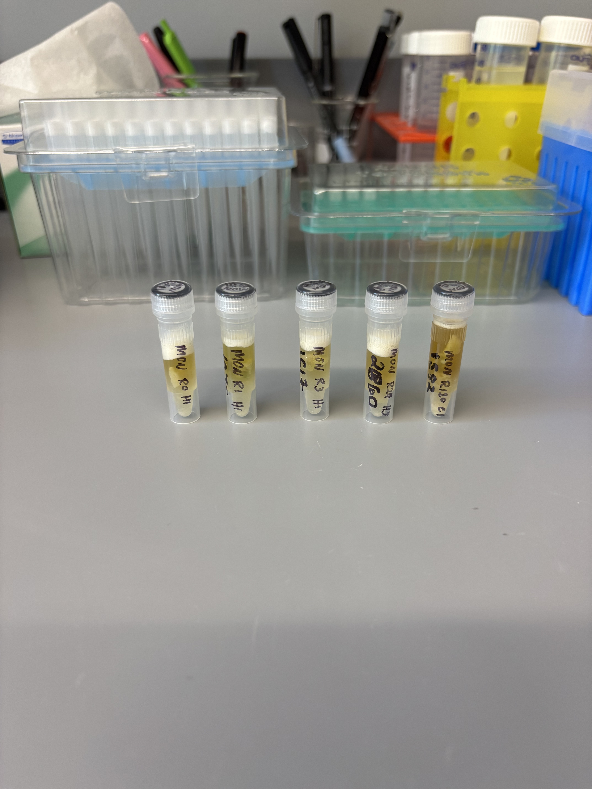
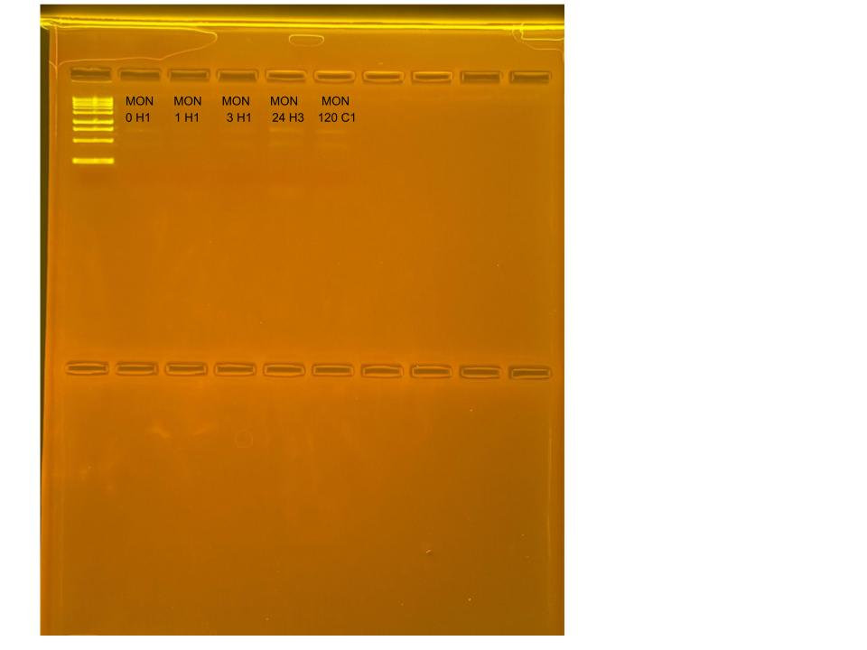

## RNA Re-extractions for Time Series Project, August 7, 2025

### [Protocol Link](https://github.com/zdellaert/ZD_Putnam_Lab_Notebook/blob/master/protocols/2022-10-03-Protocols_Zymo_Quick_DNA_RNA_Miniprep_Plus.md)

### Re-extraction of 5 *Montipora capitata* samples from the Time Series experiment done in June and July of 2025. These samples did not yield enough RNA to be measured by HS RNA Qubit so re-extraction was needed.

### Samples

The sample IDs are MON 0 H1, MON 1 H1, MON 3 H1, MON 24 H3, and MON 120 C1.

 Image taken after bead beating

## Notes

- For sample prep bead beat was used in the original tube and vortexed for an additional 1 minute. 
- Increased Pro K digestion time to 30 mins for all samples 
- Eluted RNA to 60 uL 
    - DNA was not extracted
- 500 uL of new DNA/RNA shield was added to sample tubes after the 400 uL was taken out for extraction for storage. 

## Qubit Results

- Used Broad range dsDNA and RNA Qubit Protocol [HERE](https://zdellaert.github.io/ZD_Putnam_Lab_Notebook/Qubit-Protocol/) 
- All samples read twice, standard only read once

HS RNA Standards: 46.63 (S1) and 926.29 (S2)

| colony_id | Species                    | RNA_QBIT_1 | RNA_QBIT_2 | RNA_QBIT_AVG |
|-----------|----------------------------|------------|------------|--------------|
| 0 H1      | *Montipora capitata*       |   4.20     | 4.40       |   4.30       |
| 1 H1      | *Montipora capitata*       |     -      |   -        |     -        |
| 3 H1      | *Montipora capitata*       |     -      |   -        |     -        |
| 24 H3     | *Montipora capitata*       |   5.40     | 5.34       |   5.37       |
| 120 C1    | *Montipora capitata*       |     -      |   -        |     -        |

- DNA samples in -20 freezer, RNA samples in -80 freezer

## DNA and RNA Quality Check gel

Ran at 80 volts for 45 minutes

